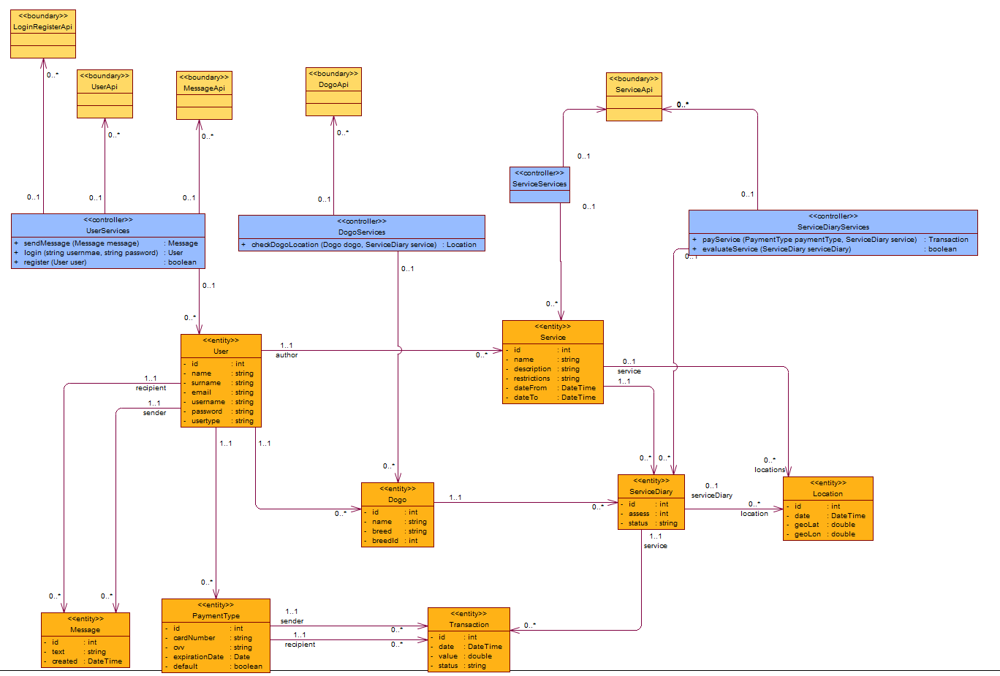
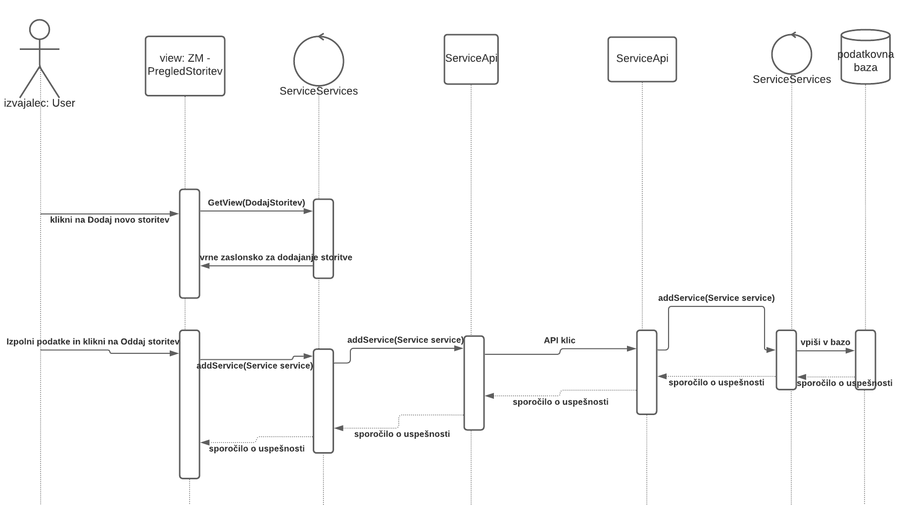
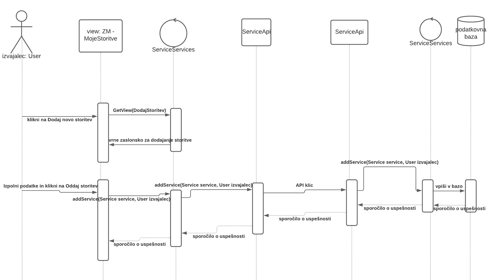
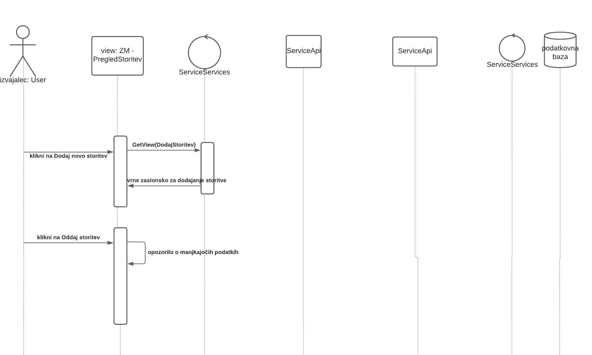
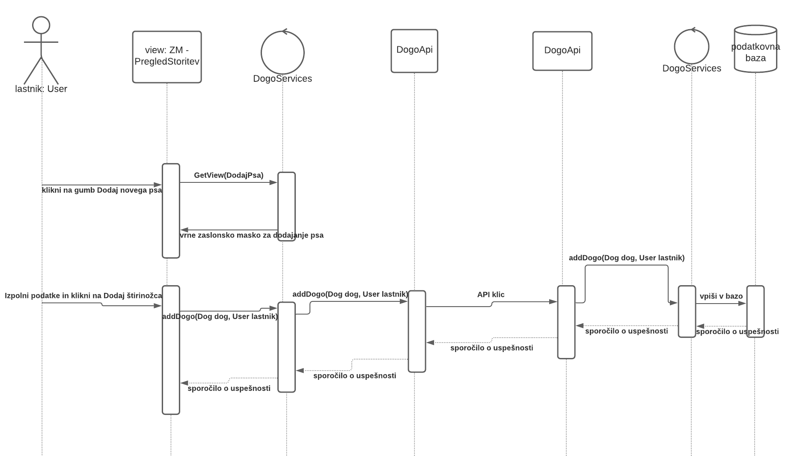
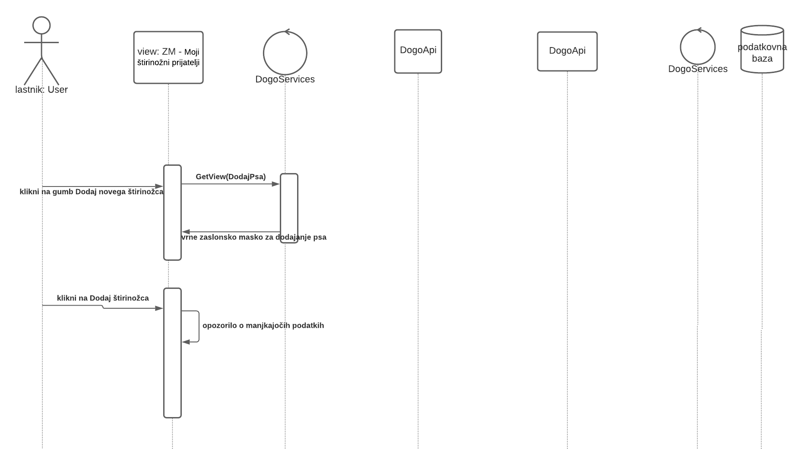
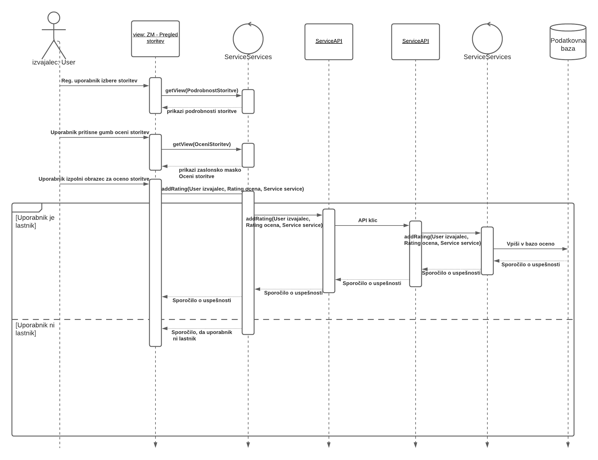

# Načrt sistema

|                             |                                                                                  |
| :-------------------------- | :------------------------------------------------------------------------------- |
| **Naziv projekta**          | Pasjehodec                                                                       |
| **Člani projektne skupine** | Matjaž Bizjak, Primož Gabrovec, Aljaž Grdadolnik, Jakob Marušič, Mitja Vendramin |
| **Kraj in datum**           | Ljubljana, 1. april 2021                                                         |

> V tem dokumentu uporabljeni izrazi, ki se nanašajo na osebe in so zapisani v moški slovnični obliki, so uporabljeni kot nevtralni za ženski in moški spol.

## Povzetek

**TO-DO**

- Povzetek je, kot že vemo, celoten dokument, strnjen v največ 150 besed.

## 1. Načrt arhitekture

**TO-DO**

- Za prikaz uporabite enostavne prikaze, kot so blokovni ali paketni diagrami. Uporabite arhitekturne vzorce.

## 2. Načrt strukture

### 2.1 Razredni diagram

> V nadaljevanju predstavljamo dva globalna razredna diagrama, ki se delita na **razredni diagram zaledne aplikacije** in **razredni diagram čelne aplikacije**. Razredna diagrama sta ločena zaradi preglednosti, komunikacija med njima pa poteka prek _boundary_ razredov, ki so paroma enaki na obeh razrednih diagramih (npr. _boundary_ razred z imenom _UserApi_ na čelnem delu aplikacije predstavlja komunikacijsko točko z _boundary_ razredom _UserApi_ na zalednem delu, pri čemer sta si oba razreda _UserApi_ identična v imenu razerda in podpisu metod).

> Ravno tako ne definiramo _get_ in _set_ metod za _private_ polja razredov. Na razrednem diagramu tudi ne definiramo metod za _CRUD operacije_ nad entiteto ali skupino entitet. Vse metode, ki izvajajo takšne operacije znotraj celotne aplikacije sledijo naslednjemu konceptu:
> `<ime-operacije><ime-entitete>(<entiteta ali entiteta-id>, [...dodatni parametri])`
>
> - Pri čemer ima parameter `ime-operacije` eno izmed naslednjih vrednosti: `create`, `read`, `update`, `delete` ali `save` (save predstavlja skupek operacij create in update, pri čemer se slednja izvede v kolikor entiteta z enakim primarni identifikatorjem že obstaja)
> - Parameter `ime-entitete` je identifikator entitetnega razreda
> - Parameter `entiteta` (ali `entiteta-id`, ki predstavlja primarni identifikator entitete) predsatvlja entiteto nad katero se izvaja dana operacija. V kolikor ni podan se operacija izvede nad vsemi objekti tipa entiteta.
> - `dodatni-parametri` so neobvezen del CRUD operacije, v kolikor so definirani, so dodatno opisani ob definiciji.
>
> * Primer: metoda `createUser(User user)` kreira novo entiteto s parametri user tipa User, metoda `deleteUser(User user)` izbriše entiteto enako podani entiteti user tipa User.\*

#### Razredni diagram zalednega dela aplikacije

#### Razredni diagram čelnega dela aplikacije

**TO-DO**

Zankrat upoštevaj, da so kontrolerji na frontendu enaki kot na backeendu. Boundary razredi za zaslonske maske pa se itak deifnira znotraj PU-

### 2.2 Opis razredov

V nadaljevanju opisujemo podrobneje opisujemo vse razrede problemske domene. Pri opisih podajamo naslednje tipe razreda:

- _entitetni tip_ je razred, ki predsatvlja smiselno celoto za hrambo dela podatkov in je neodvisen od okolja. Skupaj s primarnim identifikatorjem razreda predsatvlja osnovo za izgradnjo podatkovnega modela. Če ni drugače navedeno, entitetni razredi nimajo nesamoumevnih metod.

> Pri opisu atributov so izpuščeni atributi razreda, ki so samoumevni iz razrednega diagrama in niso bistvenega pomena za razumevanje oz. ne potrebujejo dodatne razlage.
> *Primer: iz razrednega diagrama je razvidno, da ima vsak objekt tipa User seznam objektov tipa Service, ki mu pripadajo. Vendar je ta asociacija samoumevna in ne potrebuje dodatnega pojasnila zato je pri opisu atributov izpuščena.*

#### **User**

Razred _User_ je entitetni razred, ki predstavlja registriranega uporabnika sistema. Z vsakega registriranega uporabnika obstaja natanko en objekt tega tipa.

#### Atributi

| Ime atributa | Tip atributa | Pomen atributa                                                              | Zaloga vrednosti |
| ------------ | ------------ | --------------------------------------------------------------------------- | ---------------- |
| id           | int          | Primarni identifikator razreda                                              |                  |
| name         | string       | ime uporabnika                                                              |                  |
| surname      | string       | priimek uporabnika                                                          |                  |
| email        | string       | epoštni naslov registriranega uporabnika (unikaten glede na tip uporabnika) |                  |
|username|string|uporabniško ime uporabnika, unikatno glede na tip uporabnika||
|password|string|kodirana vrednost uporabniškega gesla za dostop||
|usertype|string|tip uporabnika|IZVAJALEC_STORITVE, LASTNIK_PSA, MODERATOR, ADMINISTRATOR|

#### **Message**

Razred _Message_ je entitetni razred, ki predstavlja eno sporočilo v medsebojni komunikaciji med dvema uporabnikoma.

#### Atributi

| Ime atributa | Tip atributa | Pomen atributa | Zaloga vrednosti |
| ------------ | ------------ | -------------- | ---------------- |
| id | int | unikaten primarni identifikator objekta | |
| text | string | vsebina sporočila | |
| created | DateTime | čas kreiranja objekta | |
| sender | User | pošilljatelj sporočila | |
| recipient | User | prejemnik sporočila, pri čemer velja `this.sender !== this.recipient`| |

#### **Service**

Razred *Service* je entitetni razred, ki predstavlja eno objavljeno storitev v sistemu. Vsaka storitev pripada natanko enemu objektu tipa *User*.

#### Atributi

| Ime atributa | Tip atributa | Pomen atributa | Zaloga vrednosti |
| ------------ | ------------ | -------------- | ---------------- |
| id | int | unikaten primarni identifikator objekta | |
| name | string | opsino ime storitve | |
| description | string | daljši opis storitve | |
| restrictions | string | seznam omejitev pri izvedbi storitve | |
| dateFrom | DateTime | začetek ponujanja storitve | |
| dateTo | DateTime | konec ponujanja storitve | `dateFrom < dateTo` |

#### **Dogo**

Razred *Dogo* je entitetni razred, ki predstavlja enega psa vnešenega v sistema. Vsak pes pripada natanko enemu objektu tipa *User* (lastniku).

#### Atributi

| Ime atributa | Tip atributa | Pomen atributa | Zaloga vrednosti |
| ------------ | ------------ | -------------- | ---------------- |
| id | int | unikaten primarni identifikator objekta | |
| name | string | opisno ime psa ||
| breed | string | pasma psa ||
| breedId| string | id pasme, kot je definiran v zunanjem sistemu DogAPI ||

#### **ServiceDiary**

Razred *ServiceDiary* je entitetni razred, ki predstavlja eno opravljeno storitev tipa Service za en objekt tipa *Dogo*. V osnovi predstavlja mnogo-mnogo povezavo med objektoma tipa *Dogo* in *Service* z dodatnimi atributi o statusu, oceni in lokaciji.

#### Atributi

| Ime atributa | Tip atributa | Pomen atributa | Zaloga vrednosti |
| ------------ | ------------ | -------------- | ---------------- |
| id | int | unikaten primarni identifikator objekta | |
| assess | int | ocena opravljene storitve| `0 <= assess =< 5` |
| status| string | status storitve | ORDERED, CURRENT, FINNISHED, PAYED, CANCELLED |

#### **Location**

Razred *Location* je entitetni razred, ki predstavlja geografsko koordinato. Glede na dodatne asociativne povezave lahko predsatvlja lokacijo, kjer se določena storitev izvaja ali trenutno lokacijo psa med izvajanjem storitve.

#### Atributi

| Ime atributa | Tip atributa | Pomen atributa | Zaloga vrednosti |
| ------------ | ------------ | -------------- | ---------------- |
| id | int | unikaten primarni identifikator objekta | |
| date | DateTime | čas kreacije | |
| geoLat | double | Latituda lokacije | |
| geoLon | double | Longituda lokacije ||
| service | Service | storitev kateri pripada lokacija ||
| serviceDiary | ServiceDiary | izvedba storitve kateri pripada lokacija ||

Objekt tipa *Location* pripada bodisi objektu tipa *Service* bodisi objektu tipa *ServiceDiary*, torej je en izmed teh dveh atributov vedno nedefiniran (˙null`).

#### **PaymentType**

Razred *PaymentType* je entitetni razred, ki predstavlja plačilno sredstvo in je vedno vezan na natanko en razred tipa *User*.

#### Atributi

| Ime atributa | Tip atributa | Pomen atributa | Zaloga vrednosti |
| ------------ | ------------ | -------------- | ---------------- |
| id | int | unikaten primarni identifikator objekta | |
| cardNumber | string | številka plačilne kartice | niz števk 0-9 |
| cvv | string | varnostna koda plačilne kartice | trimestni niz števk 0-9 |
| expirationDate | Date | datum veljavnosti plačilne kartice | |
| default | boolean | Če je vrednost `true` gre za privzeto plačilno sredstvo na katero se privzeto prenašajo plačilne transakcije. ||

#### **Transaction**

Razred *Transaction* je entitetni razred, ki predstavlja plačilno transakcijo izvedeno med dvema objektoma tipa *PaymantType* in je vezan na en objekt tipa *ServiceDiary* (za izvedeno storitev).

#### Atributi

| Ime atributa | Tip atributa | Pomen atributa | Zaloga vrednosti |
| ------------ | ------------ | -------------- | ---------------- |
| id | int | unikaten primarni identifikator objekta | |
| date | DateTime | čas opravljene transakcije | |
| value | double | vrednost transkacije | |
| status | string | status transakcije | PENDING, COMPLETED |
| sender | PaymentType | plačilno sredstvo kateremu gre transakcija v breme ||
| recipient | PaymentType | plačilno sredstvo kateremu gre transakcija v dobro||
| service | ServiceDiary | storitev za katero se transkcija izvede||

#### Ime razreda **TO-DO**

- Koncept iz problemske domene, ki ga razred predstavlja.

#### Atributi

**TO-DO**

- Za vsak atribut navedite:
  - ime atributa,
  - podatkovni tip, če ta ni očiten,
  - pomen, če ta ni samoumeven,
  - zalogo vrednosti, če ta ni neomejena ali očitna.

#### Nesamoumevne metode

**TO-DO**

- Za vsako metodo navedite:
  - ime metode,
  - imena in tipe parametrov,
  - tip rezultata,
  - pomen (če ta ni dovolj očiten iz naziva metode in njenih parametrov).

## 3. Načrt obnašanja

**TO-DO**

- Za izdelavo načrta obnašanja lahko uporabite:
  - diagrame zaporedja,
  - končne avtomate,
  - diagrame aktivnosti,
  - diagrame stanj in
  - psevdokodo.

### 3.1 Registracija lastnika psa ali ponudnika storitve
Uporabnik se lahko v aplikacijo registrira preko zaslonske maske za registracijo.

#### Osnovni tok
Osnovni tok poteka na sledeči način. Uporabnik klikne na gumb "Registracija novega lastnika psa". Izrisala se mu bo zaslonska maska za registracijo. Nato uporabnik
vnese vse potrebne podatke ter klikne na gumb "Registracija". Spletna aplikacija bo posredovala podatke strežniku, le ta pa bo zapisal novega uporabnika
v podatkovno bazo. Ob uspešnem zapisu bo strežnik uporabniku na email posredoval žeton, hkrati pa bo posredoval spletni aplikaciji sporočilo, da je nov uporabnik
bil uspešno ustvarjen.

.png)

#### Alternativni tok
Do zaslonske maske lahko uporabnik pride tudi po alternativni poti. In sicer lahko se najprej premakne na zaslonsko masko "Prijava", nato pa tam klikne na gumb
"Nisem še registriran, registriraj me sedaj", ki ga bo preusmeril na zaslonsko masko za registracijo. Nato poteka registracija na isti način kot pri osnovnem toku.
.png)

#### Izjemni tok
V primeru da uporabnik ne vnese vseh potrebnih podatkov, ga bo spletna aplikacija ob kliku na gumb "Registracija" o tem opozorila, ter preprečila
nasaljevanje registracije, dokler niso vsa polja izpolnjena.

V primeru da so vnešeni podatki isti podatkom, ki so že zapisani v podatkovni bazi, nam bo podatkovna baza sporočila da registracija uporabnika ni mogoča
saj le ta že obstaja. Nato bo strežnik sporočil to spletni aplikaciji, ki bo uporabnika obvestila da uporabnik že obstaja.
.png)

### 3.2 Prijava uporabnika
Uporabnik se lahko v aplikacijo prijavi preko zaslonske maske za prijavo.

#### Osnovni tok
Osnovni tok poteka na sledeči način. Uporabnik klikne na gumb "Prijava uporabnika". Izrisala se mu bo zaslonska maska za prijavo. Ko vnese vse
potrebne podatke klikne na gumb "prijava". Spletna aplikacija bo povprašala strežnik ali uporabnik obstaja ter ali je vnešena pravilna kombinacija uporabniškega
imena in gesla. Strežnik bo pogledal v podatkovno bazo ob uspešni poizvedbi bo vrnil sporočilo da je uporabnik prijavljen. Spletna aplikacija bo uporabnika
obvestila o uspešni prijavi ter ga prijavila v aplikacijo.

.png)

#### Alternativni tok
Do zaslonske maske lahko uporabnik pride tudi po alternativni poti. In sicer lahko se najprej premakne na zaslonsko masko "Registracija novega lastnika psa" ali  "Registracija novega ponudnika storitev", nato pa tam klikne na gumb
"Registracijo sem že opravil, prijavi me", ki ga bo preusmeril na zaslonsko masko za prijavo. Nato poteka prijava na isti način kot pri osnovnem toku.
.png)

#### Izjemni tok
V primeru da uporabnik ne vnese pravilne kombinacije uporabniškega imena in gesla, bo pri preverbi na strani strežnika prišlo do napake. Le ta bo spletni aplikaciji
napako sporočil, ta pa bo uporabnika obvestila o neuspešni prijavi zaradi napačne kombinacije uporabniškega imena in gesla.

V primeru da uporabnik z vnešenim uporabniškim imenom ne obstaja, bo pri preverbi na strani strežnika prišlo do napake. Le ta bo spletni aplikaciji
napako sporočil, ta pa bo uporabnika obvestila o neuspešni prijavi zaradi neobstoječega uporabnika.
.png)

### 5.4 Dodaj storitev
#### Osnovni tok
Storitev dodamo lahko samo kot uporabnik tipa "Izvajalec". Storitev dodamo tako, da na zaslonski maski "Pregled storitev" izberemo možnost "Dodaj novo storitev". Na novo odprti vlogi izpolnimo podatke in pritisnemo na gumb "Oddaj ponudbo". Podatki se zatem posredujejo kontrolerju, ki jih preko API klica posreduje strežniku. Kontroler na strani strežnika podatke vpiše v bazo, uporabniku pa se prikaže obvestilo o uspešnosti dodajanja storitve.

#### Alternativni tok
Storitev lahko dodamo prav tako iz zaslonske maske "Pregled preteklih storitev", kjer izberemo možnost "Dodaj novo storitev". Na vlogi izpolnimo podatke in pritisnemo gumb "Oddaj ponudbo". Po oddaji se podatki posredujejo strežniku, kjer se shranijo v bazo.Uporabniku se prikaže obvestilo o statusu oddaje.

#### Izjemni tok
Če pri dodajanju storitve ne izpolnimo vseh zahtevanih podatkov in kliknemo na gumb "Oddaj ponudbo" se nam na zaslonu izpiše, da manjkajo zahtevani podatki za oddajo ponudbe.

### 5.5 Dodaj psa
#### Osnovni tok

Psa lahko dodamo kot uporabnik tipa "Lastnik". Na zaslonski maski izberemo možnost "Dodaj novega psa". Na odprti vlogi izolnimo zahtevane podatke in kliknemo na gumb "Dodaj štirinožca". Podatki se preko kontrolerja posredujejo z API klicem na strežnik, kjer se preko kontrolerja zapišejo v bazo. Uporabniko se posreduje sporočilo o uspešnosti shranjevanja.

#### Alternativni tok

Psa lahko dodamo tudi iz zavihka "Moji štirinožni prijatelji" na profilu uporabnika. Izberemo možnost "Dodaj novega štirinožca" in po izpolnitvi vloge pritisnemo na gumb "Dodaj štirinožca". Po oddaji se podatki posredujejo strežniku, ki zapiše podatke v bazo. Uporabniku se vrne status izvedene operacije.

#### Izjemni tok

Če pri dodajanju psa ne izpolnimo vseh zahtevanih podatkov in kliknemo na gumb "Dodaj štirinožca" se nam na zaslonu izpiše, da manjkajo zahtevani podatki za dodajanje psa.

### 5.6 Kopiraj storitev

Pod zaslonsko masko "Pretekle storitve" lahko izberemo možnost kopiranja storitve samo v primeru, da kot izvajalec imamo storitve, ki smo jih izvedli v preteklosti. S klikom na gumb "Kopiranje vsebine v novo storitev" se v novi zaslonski maski "Kopiraj storitev" v spustnem meniju prikažejo pretekle storitve, ki jih preko API-ja dobimo iz podatkovne baze na strežniku. S klikom na bumb "Kopiraj" se prepišejo podatki v vlogo nove storitve. Zatem lahko uredimo želene podatke in pritisnemo na gumb "Dodaj storitev", ki s pomočjo kontrolerja izvede API klic na strežnik za zapis nove storitve v podatkovno bazo.

### 3.12 ali 5.12
#### Osnovni tok

### Alternativni tok

