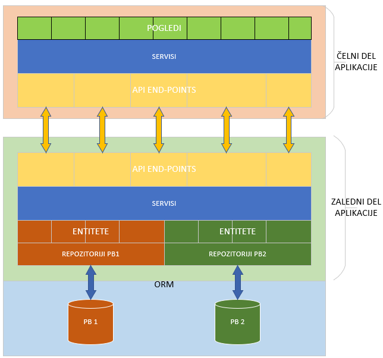
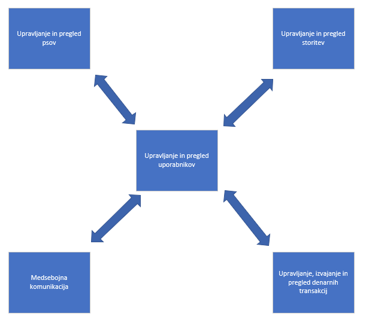
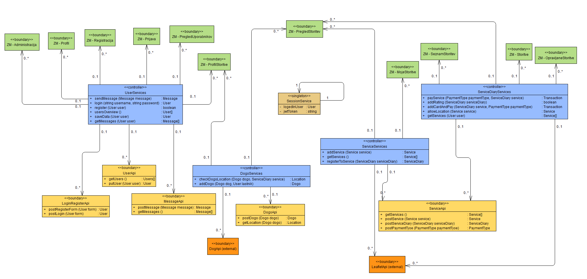
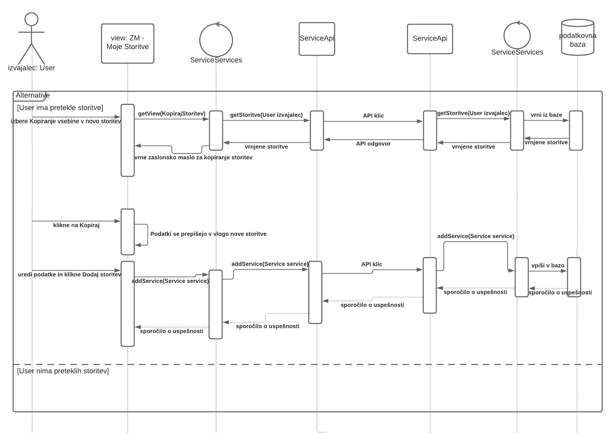
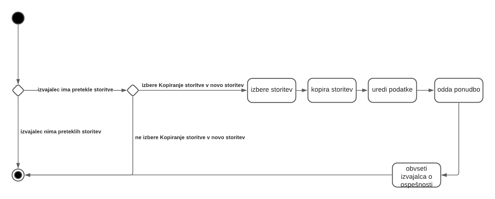
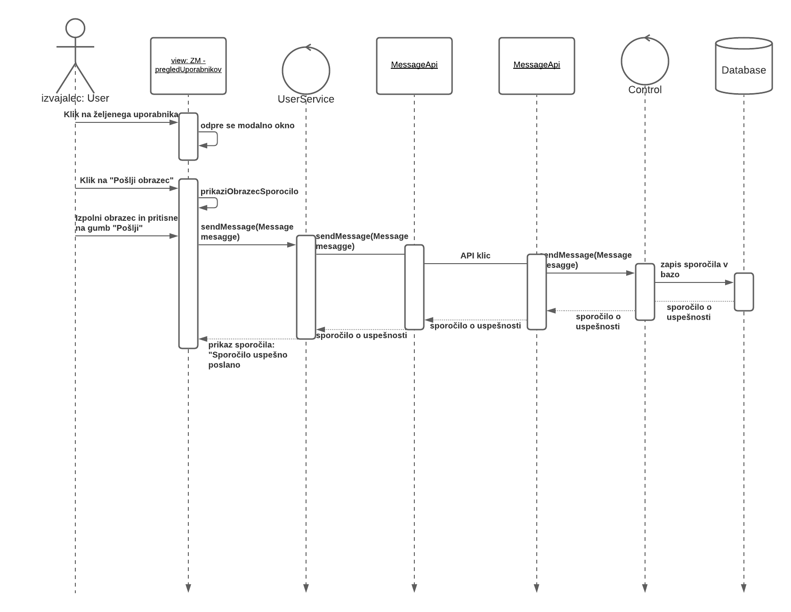
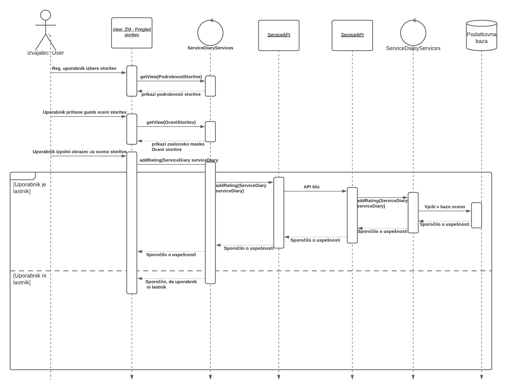

# Načrt sistema

|                             |                                                                                  |
| :-------------------------- | :------------------------------------------------------------------------------- |
| **Naziv projekta**          | Pasjehodec                                                                       |
| **Člani projektne skupine** | Matjaž Bizjak, Primož Gabrovec, Aljaž Grdadolnik, Jakob Marušič, Mitja Vendramin |
| **Kraj in datum**           | Ljubljana, 1. april 2021                                                         |

> V tem dokumentu uporabljeni izrazi, ki se nanašajo na osebe in so zapisani v moški slovnični obliki, so uporabljeni kot nevtralni za ženski in moški spol.

## Povzetek

Če nadaljujejo s starim afriškim pregovorom, vas odgovorna za vzgojo otroka bo le-to izvedla veliko kakovostneje, če se bo pri tem posluževala dobrih praks in oblikovanega načrta razumljivega vsakemu posamezniku v vasi. Ravno iz tega razloga je spletna aplikacija Pasjehodec deležna še zadnje stopničke pred dejansko implementacijo – dokument načrta sistema.

V načrtu sistema razvijalci Pasjehodca predstavimo bistvene elemente sistema – načrte arhitekture, načrte strukture in načrte obnašanja. Pri tem smo se posluževali standardnih tehnik in dobrih praks razvoja programske opreme, ki v največji meri zagotavljajo kakovost končne implementacije.

Spomnimo – aplikacija Pasjehodec omogoča lastnikom psov, da med ponujenimi storitvami, ki jih ponujajo raznorazni izvajalci storitev izberejo storitev za svojega štirinožca, naj si bo to sprehod, pasji frizer ali kaj drugega. Poleg tega si lahko lastnik pas in izvajalec storitev neposredno dopisujejo in poravnajo ceno storitve – vse znotraj aplikacije.

## 1. Načrt arhitekture

### Procesni pogled

Arhitektura sistema je bazirana na principih večnivojskih mikrosotritev. S tem v mislih je sistem zasnovan z neodvisnima komponentoma - čelnim in zalednim delom, ki medsebojno komunicirata s REST API-jem. Več nivojska arhitektura, ki medsebojno skrbi za izolacije in proces izmenjave podatkov med nivoji je prikazana na spodnjem diagramu.

### Logični pogled

Sistem je na logičnem nivoju zasnovan v petih modulih: 
- **Upravljanje in pregled uporabnikov** vsebuje vse podatkovne, mejne in razrede poslovne logike, ki so potrebni za pregled vseh uporabnikov sistema, posameznega uporabnika sistem in upravljenje z uporabniki, kar vključuje registracijo novih uporabnikov, logiranje registraranih uporabnikov in brisanje uporabnikov.
- **Upravljanje in pregled storitev** vsebuje vse podatkovne in mejne razrede ter razrede poslovne logike, ki so potrebni za pregled in upravljanje s storitvami, ki jih dodajajo registrarani uporabniki sistema.
- **Upravljanje in pregled psov** vsebuje vse podatkovne in mejne razrede ter razrede poslovne logike, ki so potrebni za pregled, urejanje in dodajanje psov, ki jih imajo lastniki psov v lasti.
- **Upravljanje, izvajanje in pregled denarnih transakcij** vsebuje vse podatkovne in mejne razrede ter razrede poslovne logike, ki so potrebni za izvajanje denarnih transakcij med dvema uporabnikoma sistema.

Na logičnem nivoju je modul za upravljenje in pregled uporabnikov bistven del sistema, saj zagotavlja podporne operacije in asociacije za vse preostale module, ki so večinoma med sebojno (lahko) neodvisni.

### Razvojni pogled

V razvojnem pogledu sistem delimo na podsisteme, podsistem pa na pakete, ki združujejo razrede in pakete z enakimi oz. podobnimi funkcionalnostmi. V grobem delimo sistem na podsisteme:na **zaledni** in **čelni** podsistem ter na podsistem za **trajno shranjevanje podatkov (podatkovne baze)**.

V nadaljevanju čelni in zaledni podsistem razdelimo na pakete s poslovnimi razredi in pakete z REST API vmesnike, ki so si paroma enaki, sortirani glede na **modul logičnega pogleda**. Poleg tega zaledni podistem vsebuje še pakete entitetnih razredov, ki jih uporabljamo za hrambo podatkov v predpisani obliki in pakete zaslonskih mask na čelnem delu.

## 2. Načrt strukture

### 2.1 Razredni diagram

> V nadaljevanju predstavljamo dva globalna razredna diagrama, ki se delita na **razredni diagram zaledne aplikacije** in **razredni diagram čelne aplikacije**. Razredna diagrama sta ločena zaradi preglednosti, komunikacija med njima pa poteka prek _boundary_ razredov, ki so paroma enaki na obeh razrednih diagramih (npr. _boundary_ razred z imenom _UserApi_ na čelnem delu aplikacije predstavlja komunikacijsko točko z _boundary_ razredom _UserApi_ na zalednem delu, pri čemer sta si oba razreda _UserApi_ identična v imenu razerda in podpisu metod).

> Ravno tako ne definiramo _get_ in _set_ metod za _private_ polja razredov. Na razrednem diagramu tudi ne definiramo metod za _CRUD operacije_ nad entiteto ali skupino entitet. Vse metode, ki izvajajo takšne operacije znotraj celotne aplikacije sledijo naslednjemu konceptu:
> `<ime-operacije><ime-entitete>(<entiteta ali entiteta-id>, [...dodatni parametri])`
>
> - Pri čemer ima parameter `ime-operacije` eno izmed naslednjih vrednosti: `create`, `read`, `update`, `delete` ali `save` (save predstavlja skupek operacij create in update, pri čemer se slednja izvede v kolikor entiteta z enakim primarni identifikatorjem že obstaja)
> - Parameter `ime-entitete` je identifikator entitetnega razreda
> - Parameter `entiteta` (ali `entiteta-id`, ki predstavlja primarni identifikator entitete) predsatvlja entiteto nad katero se izvaja dana operacija. V kolikor ni podan se operacija izvede nad vsemi objekti tipa entiteta.
> - `dodatni-parametri` so neobvezen del CRUD operacije, v kolikor so definirani, so dodatno opisani ob definiciji.
>
> * Primer: metoda `createUser(User user)` kreira novo entiteto s parametri user tipa User, metoda `deleteUser(User user)` izbriše entiteto enako podani entiteti user tipa User.\*

#### Razredni diagram zalednega dela aplikacije

#### Razredni diagram čelnega dela aplikacije

### 2.2 Opis razredov

V nadaljevanju opisujemo podrobneje opisujemo vse razrede problemske domene. Pri opisih podajamo naslednje tipe razreda:

- _entitetni tip_ je razred, ki predsatvlja smiselno celoto za hrambo dela podatkov in je neodvisen od okolja. Skupaj s primarnim identifikatorjem razreda predsatvlja osnovo za izgradnjo podatkovnega modela. Če ni drugače navedeno, entitetni razredi nimajo nesamoumevnih metod.
- *kontrolni tip* je razred *(tudi servisni razred)*, ki vsebuje smiselno zaključeno celoto poslovne logike, ki se izvaja nad delom entitetnih in mejnih razredov. Na zalednem delu aplikacije kontrolni razredi smiselno izvajajo poslovno logiko med entitetnimi razredi in med mejnimi razredi REST API vmesnika, na čelnem delu aplikacije pa med mejnimi razredi REST API vmesnika in mejnimi razredi zaslonskih mask. V osnovi so si, kar se tiče metod poslovne logike, paroma enaki na čelnem in zalednem delu aplikacije. Če ni definirano drugače velja, da kontrolni razredi ne vsebujejo atributov (razen atributov, ki so povezani z asociacijami).
- *kontrolni tip* označen s *singleton* je posebna vrsta kontrolnega razreda, za katero velja, da je dostopna iz vseh ostalih kontrolnih razredov (zaradi preglednosti so asociacije na razrednem diagramu izpuščene). Za *singleton* razred velja, da čez celoten življenjski cikel aplikacije obstaja ena in natanko ena instanca tega razreda.
- *mejni tip* je razred, ki predstavlja mejo med implementiranim sistemom in zunanjim sistemom ali uporabnikom. Ob enem predstavljajo paroma enaki mejni razredi na čelnem in zalednem delu aplikacije REST API komunikacijski vmesnik za prenos podatkov med čelnem in zalednem delu. Če ni definirano drugače velja, da kontrolni razredi ne vsebujejo atributov (razen atributov, ki so povezani z asociacijami).
- poseben tip mejnega razreda je mejni razred s končnico *Api*, takšni razredi obstajajo paroma enaki na čelnem in zalednem delu aplikacije (če ni drugače navenedeno) in predstavljajo REST API komunikacijske točke, ki kreirajo HTTP zahtevo (čelni del, odjemalec) ali na njo odgovarjajo (zaledni del, strežnik) - imena metod so definirana po standardnem principu `http-zahtevaIme_entitete()` in jih kot takšne ne posebej opisujemo.

> Pri opisu atributov so izpuščeni atributi razreda, ki so samoumevni iz razrednega diagrama in niso bistvenega pomena za razumevanje oz. ne potrebujejo dodatne razlage.
> *Primer: iz razrednega diagrama je razvidno, da ima vsak objekt tipa User seznam objektov tipa Service, ki mu pripadajo. Vendar je ta asociacija samoumevna in ne potrebuje dodatnega pojasnila zato je pri opisu atributov izpuščena.*

#### **User**

Razred _User_ je entitetni razred, ki predstavlja registriranega uporabnika sistema. Z vsakega registriranega uporabnika obstaja natanko en objekt tega tipa.

#### Atributi

| Ime atributa | Tip atributa | Pomen atributa                                                              | Zaloga vrednosti |
| ------------ | ------------ | --------------------------------------------------------------------------- | ---------------- |
| id           | int          | Primarni identifikator razreda                                              |                  |
| name         | string       | ime uporabnika                                                              |                  |
| surname      | string       | priimek uporabnika                                                          |                  |
| email        | string       | epoštni naslov registriranega uporabnika (unikaten glede na tip uporabnika) |                  |
|username|string|uporabniško ime uporabnika, unikatno glede na tip uporabnika||
|password|string|kodirana vrednost uporabniškega gesla za dostop||
|usertype|string|tip uporabnika|IZVAJALEC_STORITVE, LASTNIK_PSA, MODERATOR, ADMINISTRATOR|

#### **Message**

Razred _Message_ je entitetni razred, ki predstavlja eno sporočilo v medsebojni komunikaciji med dvema uporabnikoma.

#### Atributi

| Ime atributa | Tip atributa | Pomen atributa | Zaloga vrednosti |
| ------------ | ------------ | -------------- | ---------------- |
| id | int | unikaten primarni identifikator objekta | |
| text | string | vsebina sporočila | |
| created | DateTime | čas kreiranja objekta | |
| sender | User | pošilljatelj sporočila | |
| recipient | User | prejemnik sporočila, pri čemer velja `this.sender !== this.recipient`| |

#### **Service**

Razred *Service* je entitetni razred, ki predstavlja eno objavljeno storitev v sistemu. Vsaka storitev pripada natanko enemu objektu tipa *User*.

#### Atributi

| Ime atributa | Tip atributa | Pomen atributa | Zaloga vrednosti |
| ------------ | ------------ | -------------- | ---------------- |
| id | int | unikaten primarni identifikator objekta | |
| name | string | opsino ime storitve | |
| description | string | daljši opis storitve | |
| restrictions | string | seznam omejitev pri izvedbi storitve | |
| dateFrom | DateTime | začetek ponujanja storitve | |
| dateTo | DateTime | konec ponujanja storitve | `dateFrom < dateTo` |

#### **Dogo**

Razred *Dogo* je entitetni razred, ki predstavlja enega psa vnešenega v sistema. Vsak pes pripada natanko enemu objektu tipa *User* (lastniku).

#### Atributi

| Ime atributa | Tip atributa | Pomen atributa | Zaloga vrednosti |
| ------------ | ------------ | -------------- | ---------------- |
| id | int | unikaten primarni identifikator objekta | |
| name | string | opisno ime psa ||
| breed | string | pasma psa ||
| breedId| string | id pasme, kot je definiran v zunanjem sistemu DogAPI ||

#### **ServiceDiary**

Razred *ServiceDiary* je entitetni razred, ki predstavlja eno opravljeno storitev tipa Service za en objekt tipa *Dogo*. V osnovi predstavlja mnogo-mnogo povezavo med objektoma tipa *Dogo* in *Service* z dodatnimi atributi o statusu, oceni in lokaciji.

#### Atributi

| Ime atributa | Tip atributa | Pomen atributa | Zaloga vrednosti |
| ------------ | ------------ | -------------- | ---------------- |
| id | int | unikaten primarni identifikator objekta | |
| assess | int | ocena opravljene storitve| `0 <= assess =< 5` |
| status| string | status storitve | ORDERED, CURRENT, FINNISHED, PAYED, CANCELLED |

#### **Location**

Razred *Location* je entitetni razred, ki predstavlja geografsko koordinato. Glede na dodatne asociativne povezave lahko predsatvlja lokacijo, kjer se določena storitev izvaja ali trenutno lokacijo psa med izvajanjem storitve.

#### Atributi

| Ime atributa | Tip atributa | Pomen atributa | Zaloga vrednosti |
| ------------ | ------------ | -------------- | ---------------- |
| id | int | unikaten primarni identifikator objekta | |
| date | DateTime | čas kreacije | |
| geoLat | double | Latituda lokacije | |
| geoLon | double | Longituda lokacije ||
| service | Service | storitev kateri pripada lokacija ||
| serviceDiary | ServiceDiary | izvedba storitve kateri pripada lokacija ||

Objekt tipa *Location* pripada bodisi objektu tipa *Service* bodisi objektu tipa *ServiceDiary*, torej je en izmed teh dveh atributov vedno nedefiniran (˙null`).

#### **PaymentType**

Razred *PaymentType* je entitetni razred, ki predstavlja plačilno sredstvo in je vedno vezan na natanko en razred tipa *User*.

#### Atributi

| Ime atributa | Tip atributa | Pomen atributa | Zaloga vrednosti |
| ------------ | ------------ | -------------- | ---------------- |
| id | int | unikaten primarni identifikator objekta | |
| cardNumber | string | številka plačilne kartice | niz števk 0-9 |
| cvv | string | varnostna koda plačilne kartice | trimestni niz števk 0-9 |
| expirationDate | Date | datum veljavnosti plačilne kartice | |
| default | boolean | Če je vrednost `true` gre za privzeto plačilno sredstvo na katero se privzeto prenašajo plačilne transakcije. ||

#### **Transaction**

Razred *Transaction* je entitetni razred, ki predstavlja plačilno transakcijo izvedeno med dvema objektoma tipa *PaymantType* in je vezan na en objekt tipa *ServiceDiary* (za izvedeno storitev).

#### Atributi

| Ime atributa | Tip atributa | Pomen atributa | Zaloga vrednosti |
| ------------ | ------------ | -------------- | ---------------- |
| id | int | unikaten primarni identifikator objekta | |
| date | DateTime | čas opravljene transakcije | |
| value | double | vrednost transkacije | |
| status | string | status transakcije | PENDING, COMPLETED |
| sender | PaymentType | plačilno sredstvo kateremu gre transakcija v breme ||
| recipient | PaymentType | plačilno sredstvo kateremu gre transakcija v dobro||
| service | ServiceDiary | storitev za katero se transkcija izvede||

#### **UserServices**

Razred *UserServices* je servisni razred, ki vsebuje poslovno logiko za operacije, ki se izvajajajo nad (če ni definirano drugače) entitetnimi razredi *User, PaymentType in Message* ter z njimi povezanimi mejnimi razredi.

#### Nesamoumevne metode

Nesamoumevne metode definirane v kontrolnem razredu na čelnem delu aplikacije:

| Ime metode | Parametri | Tip rezultata | Pomen |
| ---------- | --------- | ------------- | ----- |
| sendMessage | message: Message| Message | preveri popolnost podatkov, zahteva pošiljanje sporočila (api klic) in vrača v ZM poslano sporočilo ali HTTP napako |
| login | username: string, password: string | User | preveri popolnost podatkov, zahteva API klic in vrača podatke o uporabniku ali HTTP napako v ZM |
| register | user: User | User | preveri popolnost podatkov, zahteva API klic in vrača status registracije v ZM |

Nesamoumevne metode definirane v istoimenskem kontrolnem razredu na zalednem delu aplikacije:

| Ime metode | Parametri | Tip rezultata | Pomen |
| ---------- | --------- | ------------- | ----- |
| sendMessage | message: Message| Message | preveri popolnost podatkov in validira podatke v PB ter vrača rezultat transakcije |
| login | username: string, password: string | User | preveri popolnost podatkov in validira podatke v PB ter vrača rezultat validacije |
| register | user: User | User | preveri in validira podatke v PB ter vrača rezultat transakcije (zapis v PB) |

#### **DogoServices**

Razred *DogoServices* je servisni razred, ki vsebuje poslovno logiko za operacije, ki se izvajajajo nad (če ni definirano drugače) entitetnimi razredi *Dogo, Location in ServiceDiary* ter z njimi povezanimi mejnimi razredi.

#### Nesamoumevne metode

Nesamoumevne metode definirane v kontrolnem razredu na čelnem delu aplikacije:

| Ime metode | Parametri | Tip rezultata | Pomen |
| ---------- | --------- | ------------- | ----- |
| checkDogoLocation | dogo: Dogo, serviceDiary: ServiceDiary | Location[] | zahteva izvedbo API klica in vrača rezultat ali HTTP napako zahteve po seznamu lokacij psa dog med izvajanje storitve serviceDiary |
| addDogo | dogo: Dog, lastnik: User | Dogo | zahteva API klic, ki vpiše novega psa v bazo ter vrača rezultat ali HTTP napako |

Nesamoumevne metode definirane v istoimenskem kontrolnem razredu na zalednem delu aplikacije:

| Ime metode | Parametri | Tip rezultata | Pomen |
| ---------- | --------- | ------------- | ----- |
| checkDogoLocation | dogo: Dogo, serviceDiary: ServiceDiary | Location[] | iz baze bere in vrača seznam lokacij psa med izvedbo storitve |
| addDogo | dogo: Dog, lastnik: User | Dogo | validiran podatke ter jih zapiše v PB |

#### **ServiceServices**

Razred *ServiceServices* je servisni razred, ki vsebuje poslovno logiko za operacije, ki se izvajajajo nad (če ni definirano drugače) entitetnimi razredi *Service, ServiceDiary, User, Location* ter z njimi povezanimi mejnimi razredi.

#### Nesamoumevne metode

Nesamoumevne metode definirane v kontrolnem razredu na čelnem delu aplikacije:

| Ime metode | Parametri | Tip rezultata | Pomen |
| ---------- | --------- | ------------- | ----- |
| addService | service: Service, izvajalec: User | Service | validira podatke, zahteva API klic za shranjevanje storitve v bazo in vrača rezultat ali HTTP napako |

Nesamoumevne metode definirane v istoimenskem kontrolnem razredu na zalednem delu aplikacije:

| Ime metode | Parametri | Tip rezultata | Pomen |
| ---------- | --------- | ------------- | ----- |
| addService | service: Service, izvajalec: User | Service | validira podatke in jih zapiše v PB |

#### **ServiceDiaryServices**

Razred *ServiceDiaryServices* je servisni razred, ki vsebuje poslovno logiko za operacije, ki se izvajajajo nad (če ni definirano drugače) entitetnimi razredi *Service, ServiceDiary, Dogo, Location* ter z njimi povezanimi mejnimi razredi.

#### Nesamoumevne metode

Nesamoumevne metode definirane v kontrolnem razredu na čelnem delu aplikacije:

| Ime metode | Parametri | Tip rezultata | Pomen |
| ---------- | --------- | ------------- | ----- |
| payService | paymentType: PaymentType, service: ServiceDiary | Transaction | zahteva API klic, ki zapiše in izvede denarno transakcijo za opravljeno storitev |
| rateService | serviceDiary: ServiceDiary | ServiceDiary | zahteva API klic, ki v PB shrani oceno storitve |

Nesamoumevne metode definirane v istoimenskem kontrolnem razredu na zalednem delu aplikacije:

| Ime metode | Parametri | Tip rezultata | Pomen |
| ---------- | --------- | ------------- | ----- |
| payService | paymentType: PaymentType, service: ServiceDiary | Transaction | validira podatke in izvede denarno transakcijo za opravljeno stroritev med lastnikom psa in izvajalcem storitve |
| rateService | serviceDiary: ServiceDiary | ServiceDiary | validira podatke in zapiše oceno storitve v PB |

#### **LoginRegisterApi**

Razred *LoginRegisterApi* je mejni api razred, ki se uporablja za komunikacijo med zalednim in čelnim delom za potrebe logiranja in registriranja uporabnikov (kontroler *UserServices*).

#### Nesamoumevne metode

Nesamoumevne metode definirane v kontrolnem razredu na čelnem delu aplikacije:

| Ime metode | Parametri | Tip rezultata |
| ---------- | --------- | ------------- |
| postRegisterForm | form: User | User |
| postLogin | form: User | User |

#### **UserApi**

Razred *UserApi* je mejni api razred, ki se uporablja za komunikacijo med zalednim in čelnim delom za potrebe poslovne logike definirane v kontrolerju *UserServices*.

#### Nesamoumevne metode

Nesamoumevne metode definirane v kontrolnem razredu na čelnem delu aplikacije:

| Ime metode | Parametri | Tip rezultata |
| ---------- | --------- | ------------- |

#### **DogoApi**

Razred *DogoApi* je mejni api razred, ki se uporablja za komunikacijo med zalednim in čelnim delom za potrebe poslovne logike definirane v kontrolerju *DogoServices*.

#### Nesamoumevne metode

Nesamoumevne metode definirane v kontrolnem razredu na čelnem delu aplikacije:

| Ime metode | Parametri | Tip rezultata |
| ---------- | --------- | ------------- |
| postDogo | dogo: Dogo | Dogo |
| getLocation | dogo: Dogo | Location[] |

#### **DogApi**

Razred *DogApi* je mejni api razred, ki se uporablja za komunikacijo med zalednim delom aplikacije in zunanjim sistemom DogAPI za potrebe poslovne logike v kontrolerju *DogoServices*.

#### Nesamoumevne metode

Nesamoumevne metode definirane v kontrolnem razredu na čelnem delu aplikacije:

| Ime metode | Parametri | Tip rezultata |
| ---------- | --------- | ------------- |

#### **ServiceApi**

Razred *ServiceApi* je mejni api razred, ki se uporablja za komunikacijo med zalednim in čelnim delom za potrebe poslovne logike definirane v kontrolerju *ServiceServices* in *ServiceDiaryServices*.

#### Nesamoumevne metode

Nesamoumevne metode definirane v kontrolnem razredu na čelnem delu aplikacije:

| Ime metode | Parametri | Tip rezultata |
| ---------- | --------- | ------------- |
| getServices | -/- | Service[] |
| postService | service: Service | Service |
| postServiceDiary | serviceDiary: ServiceDiary | ServiceDiary |

#### Mejni razredi - zaslonske maske/view

Mejni *(boundary)* razredi so mejni razredi posebnega tipa, ki ne vsebujejo atributov (razen atributov, ki izhajajo iz asociacij) in metod (razen metod, ki so bodisi samoumevne ali izhajajo neposredno iz asociacij).

Zatorej mejne razrede zaslonski mask zgolj navajamo v skupni tabeli.

| Ime razreda | Opis |
| ----------- | ---- |
|||

TODO

## 3. Načrt obnašanja

V nadaljevanju definiramo načrte obnašanja za vse primere uporabe, ki izhajajo iz funkcionalnih zahtev definiranih v dokumentu zajema zahtev.

> API klici so na diagramih izpuščeni zaradi preglednosti. Opisani so pred pripadajočim grafom.

### 3.1 Registracija lastnika psa ali ponudnika storitve
Uporabnik se lahko v aplikacijo registrira preko zaslonske maske za registracijo.
API klic na naslednjih treh diagramih predstavlja klic metode `User postRegisterForm(User form)`.

#### Osnovni tok
Osnovni tok poteka na sledeči način. Uporabnik klikne na gumb "Registracija novega lastnika psa" ali "Registracija novega ponudnika storitev". Obrazca za registracijo sta različna, vendar je nadaljni tok isti.
Izrisala se mu bo zaslonska maska za registracijo. Nato uporabnik
vnese vse potrebne podatke ter klikne na gumb "Registracija". Spletna aplikacija bo posredovala podatke strežniku, le ta pa bo zapisal novega uporabnika
v podatkovno bazo. Ob uspešnem zapisu bo strežnik uporabniku na email posredoval žeton, hkrati pa bo posredoval spletni aplikaciji sporočilo, da je nov uporabnik
bil uspešno ustvarjen.

.png)

#### Alternativni tok
Do zaslonske maske lahko uporabnik pride tudi po alternativni poti. In sicer lahko se najprej premakne na zaslonsko masko "Prijava", nato pa tam klikne na gumb
"Nisem še registriran, registriraj me sedaj", ki ga bo preusmeril na zaslonsko masko za registracijo. Nato poteka registracija na isti način kot pri osnovnem toku.
.png)

#### Izjemni tok
V primeru da uporabnik ne vnese vseh potrebnih podatkov, ga bo spletna aplikacija ob kliku na gumb "Registracija" o tem opozorila, ter preprečila
nadaljevanje registracije, dokler niso vsa polja izpolnjena.

V primeru da so vnešeni podatki isti podatkom, ki so že zapisani v podatkovni bazi, nam bo podatkovna baza sporočila da registracija uporabnika ni mogoča
saj le ta že obstaja. Nato bo strežnik sporočil to spletni aplikaciji, ki bo uporabnika obvestila da uporabnik že obstaja.
.png)

### 3.2 Prijava uporabnika
Uporabnik se lahko v aplikacijo prijavi preko zaslonske maske za prijavo.
API klic na naslednjih treh diagramih predstavlja klic metode `User postLogin(User form)`.

#### Osnovni tok
Osnovni tok poteka na sledeči način. Uporabnik klikne na gumb "Prijava uporabnika". Izrisala se mu bo zaslonska maska za prijavo. Ko vnese vse
potrebne podatke klikne na gumb "prijava". Spletna aplikacija bo povprašala strežnik ali uporabnik obstaja ter ali je vnešena pravilna kombinacija uporabniškega
imena in gesla. Strežnik bo pogledal v podatkovno bazo ob uspešni poizvedbi bo generiral JWT žeton ter vrnil podatke o uporabniku in generirani JWT žeton. Spletna aplikacija bo uporabnika
obvestila o uspešni prijavi hkrati pa bo zapisala podatke o uporabniku ter prejeti JWT žeton v SessionService.

.png)

#### Alternativni tok
Do zaslonske maske lahko uporabnik pride tudi po alternativni poti. In sicer lahko se najprej premakne na zaslonsko masko "Registracija novega lastnika psa" ali  "Registracija novega ponudnika storitev", nato pa tam klikne na gumb
"Registracijo sem že opravil, prijavi me", ki ga bo preusmeril na zaslonsko masko za prijavo. Nato poteka prijava na isti način kot pri osnovnem toku.
.png)

#### Izjemni tok
V primeru da uporabnik ne vnese pravilne kombinacije uporabniškega imena in gesla, bo pri preverbi na strani strežnika prišlo do napake. Le ta bo spletni aplikaciji
napako sporočil, ta pa bo uporabnika obvestila o neuspešni prijavi zaradi napačne kombinacije uporabniškega imena in gesla.

V primeru da uporabnik z vnešenim uporabniškim imenom ne obstaja, bo pri preverbi na strani strežnika prišlo do napake. Le ta bo spletni aplikaciji
napako sporočil, ta pa bo uporabnika obvestila o neuspešni prijavi zaradi neobstoječega uporabnika.
.png)

### 3.3 Pregled vseh ponujenih storitev in naročilo izbrane storitve v okviru aplikacije
Ob uspešni prijavi bo aplikacija uporabnika preusmerila na seznam vseh ponujenih storitev.
API klic na naslednjih dveh diagramih predstavlja klic metode `Service[] getServices()` za pridobitev seznama storitev ter API klic `ServiceDiary postServiceDiary(ServiceDiary ServiceDiary)` 

#### Osnovni tok
Pogoj da se prične osnovni tok je prijavljen uporabnik. V kolikor uporabnik ni prijavljen do tega pogleda ne more dostopati. Ko je izpolnjen pogoj
se začne osnovni tok. Spletna aplikacija po preko APIja povprašala strežnik o seznamu storitev. Le ta bo dostopal do podatkovne baze ter aplikaciji 
vrnil seznam vseh storitev. Ko aplikacija izriše seznam storitev lahko uporabnik klikne na katerokoli izmed njih. Aplikacija mu bo izpisala
podrobnosti ibrane storitve. V kolikor je prijavljen uporabnik lastnik psa ima ob storitvi tudi gumb za naročitev storitve. Če uporabnik klikne na gumb
bo spletna aplikacija poslala zahtevo za naročitev storitve strežniku. Ta bo uporabnika naročil na storitev, tako da bo to zapisal v podatkovno bazo.
Ob uspešnem zapisu bo strežnik obvestil spletno aplikacijo, le ta pa bo uporabnika obvestila o uspešnem naročilu na storitev.

.png)

#### Izjemni tok
V primeru da strežnik spletni aplikaciji vrne prazen seznam, bo aplikacija obvestila uporabnika da v sistemu ni trenutno aktivnih storitev.
.png)

Za lažje razumevanje poteka (več pogojev) je priložen še spodnji diagram poteka, ki vsebuje tako osnovni kot izjemni tok.

### 3.4 Dodajanje nove ponudbe storitve kot izvajalec storitve
#### Osnovni tok
Storitev dodamo lahko samo kot uporabnik tipa "Izvajalec". Storitev dodamo tako, da na zaslonski maski "Pregled storitev" izberemo možnost "Dodaj novo storitev". Na novo odprti vlogi izpolnimo podatke in pritisnemo na gumb "Oddaj ponudbo". Podatki se zatem posredujejo kontrolerju, ki jih preko API klica posreduje strežniku. Kontroler na strani strežnika podatke vpiše v bazo, uporabniku pa se prikaže obvestilo o uspešnosti dodajanja storitve.

API klic v grafu predstavlja klic metode `Service postService(Service service)`.

#### Alternativni tok
Storitev lahko dodamo prav tako iz zaslonske maske "Pregled preteklih storitev", kjer izberemo možnost "Dodaj novo storitev". Na vlogi izpolnimo podatke in pritisnemo gumb "Oddaj ponudbo". Po oddaji se podatki posredujejo strežniku, kjer se shranijo v bazo.Uporabniku se prikaže obvestilo o statusu oddaje.

API klic v grafu predstavlja klic metode `Service postService(Service service)`.

#### Izjemni tok
Če pri dodajanju storitve ne izpolnimo vseh zahtevanih podatkov in kliknemo na gumb "Oddaj ponudbo" se nam na zaslonu izpiše, da manjkajo zahtevani podatki za oddajo ponudbe.

### 3.5 Dodajanje novega psa z njegovimi lastnostmi kot lastnik psa
#### Osnovni tok

Psa lahko dodamo kot uporabnik tipa "Lastnik". Na zaslonski maski izberemo možnost "Dodaj novega psa". Na odprti vlogi izolnimo zahtevane podatke in kliknemo na gumb "Dodaj štirinožca". Podatki se preko kontrolerja posredujejo z API klicem na strežnik, kjer se preko kontrolerja zapišejo v bazo. Uporabniko se posreduje sporočilo o uspešnosti shranjevanja.

API klic v grafu predstavlja klic metode `Dogo postDogo(Dogo dogo)`.

#### Alternativni tok

Psa lahko dodamo tudi iz zavihka "Moji štirinožni prijatelji" na profilu uporabnika. Izberemo možnost "Dodaj novega štirinožca" in po izpolnitvi vloge pritisnemo na gumb "Dodaj štirinožca". Po oddaji se podatki posredujejo strežniku, ki zapiše podatke v bazo. Uporabniku se vrne status izvedene operacije.

API klic v grafu predstavlja klic metode `Dogo postDogo(Dogo dogo)`.

#### Izjemni tok

Če pri dodajanju psa ne izpolnimo vseh zahtevanih podatkov in kliknemo na gumb "Dodaj štirinožca" se nam na zaslonu izpiše, da manjkajo zahtevani podatki za dodajanje psa.

### 3.6 Kopiranje vsebine pretečene storitve v novo storitev, kot izvajalec storitev

Pod zaslonsko masko "Pretekle storitve" lahko izberemo možnost kopiranja storitve samo v primeru, da kot izvajalec imamo storitve, ki smo jih izvedli v preteklosti. S klikom na gumb "Kopiranje vsebine v novo storitev" se v novi zaslonski maski "Kopiraj storitev" v spustnem meniju prikažejo pretekle storitve, ki jih preko API-ja dobimo iz podatkovne baze na strežniku. S klikom na bumb "Kopiraj" se prepišejo podatki v vlogo nove storitve. Zatem lahko uredimo želene podatke in pritisnemo na gumb "Dodaj storitev", ki s pomočjo kontrolerja izvede API klic na strežnik za zapis nove storitve v podatkovno bazo.

API klic v grafu predstavlja klic metode `Service postService(Service service)`.

Diagram aktivnosti je namenjem lažjemu razumevanju poteka funckionalnosti in zaporedju akcij le-te.

### 3.7 Pregled in urejanje podatkov uporabnika kot administrator sistema

#### Osnovni tok

Administrator sistema ima pravico pregledovati ter spreminjati podtke vseh prijavljenih uporabnikov.
API klic na diagramu predstavlja klic metode `Service[] getServices()` ter `User putUser`.

#### Izjemni tok

To operacijo lahko izvajajo izključno administratorji sistema.

### 3.8 Pregled in urejanje podatkov prijavljenega uporabnika, pregled javnih podatkov uporabnika

#### Osnovni tok

Prijavljen uporabnik lahko pregleduje svoje podatke, ter jih tudi spreminja.
API klic na diagramu predstavlja klic metode `User putUser`.

#### Alternativni tok

Neprijavljen uporabnik tudi lahko dostopa do profilov registriranih uporabnikov preko posredovane povezave.

### 3.9 Izvajanje plačila za opravljeno storitev znotraj aplikacije

API klic na diagramu predstavlja klic metode `ServiceApi payServices()`.

#### Osnovni tok

Prijavljen lastnik psov lahko izvajalcu storitev plača.

#### Alternativni tok

Če lastnik psov še ni vnesel plačilnega sredstva, to lahko stori hkrati s plačilom.

#### Izjemni tok

Plačilo seveda ni mogoče, če so vneseni podatki o kartici napačni ali pa če na plačilnem sredstvu ni dovolj denarja.

### 3.10 Pregled lokacije psa v posestvi lastnika psa v času izvajanja storitve
Ker lastnika psa seveda lahko skrbi, kje se nahaja njegov ljubi štirinožec, ta lahko pregleda zadnjo lokacijo izvajalca z mislijo, da s tem tudi ljubljenčka.
#### Osnovni tok

Uporabnik se prijavi v aplikacijo in v svojem profilu najde željeno storitev, kateri bo sledil. Ko pritisne gumb "Spremljaj lokacijo", se mu ta prikaže na zaslonu.  
Api klic tu predstavlja `DogoApi getLocation(Dogo dogo)`

#### Izjemni tok
Dandanes so privatni podatki veliko vredni, poleg tega pa tudi ni vsem všeč, če ima kdorkoli dostop do njih, zato aplikacija omogoča, da izvajalcu, zaradi takih ali drugačnih razlogov, ni potrebno deliti svoje lokacije.  
Z drugega vidika, pa je popolnoma normalno za lastnike psov, da jih skrbi, kje se nahajajo, v trenutku, ko niso v njihovi oskrbi.  
Zato je omogočeno, da ko lasnik želi najeti storitev, da mu je prej sporočeno ali izvajale omogoča sledenje njegovi lokaciji. V primeru da ali ne, se lastniku pred zaključenim najemom storitve to prikaže.  
Api klic tu predstavlja `DogoApi getLocation(Dogo dogo)`

### 3.11

Uporabniki ne glede na to ali so uporabniki ali ponudniki, se želijo kdaj pa kdaj pogovoriti, pa naj gre za skrb lastnika glede svojega ljubljenčka, ali pa pomanjkanje socialne interakcije v času izolacije.  
V ta namen aplikacija omogoča pogovarjanje preko sporočil, kar preko nje same.

#### Osnovni tok
V osnovnem toku je predstavljen potek iz strani pošiljatelja, ki najde željenega ponudnika, izpolni pošiljateljski obrazec za sporočilo, tega pošlje, nazaj pa dobi potrdilo, da je bilo sporočilo uspešno poslano.
Api klic tu predstavlja `UserAPI sendMessage(Message message)`

#### Alternativni tok
Alternativni tok pa predvideva uporabnika kot prejemnika, ki sporočilo prejme. To se mu prikaže v nabiralniku, v primeru da sporočilo obstaja, vendar je na bazi napaka, pa ga o tem obvesti, ko sporočilo želi pogledati.  
Api klic tu predstavlja `UserAPI sendMessage(Message message)`

### 3.12 Ocenjevanje opravljene storitve izvajalce storitve
Izkušnje z izvajalci storitev so lahko različne in predvsem so subjektivne. V ta namen je omogočena funkcija glasovanja. Lastnik psov lahko po zaključeni storitvi poda oceno izvajalcu storitve ne glede na to ali je bil zadovoljen ali ne. S tem pa pripomore k temu, da bodo tisti izvajalci z boljšimi
ocenami imeli boljši ugled in bili s tem nagrajeni za dobro delo.

#### Osnovni tok
V osnovnem toku se predvideva, da je uporabnik prijavljen v aplikacijo in da storitev poišče na seznamu vseh storitev. Nato oceni željeno storitev z oceno od 1 do 5 tačk, kjer 1 predstavlja najnižjo oceno 5 pa najvišjo.  
Oceno odda, kjer v primeru, da je lastnik psov, se ta zapiše v bazo, v primeru da ni(kar se pregleda na čelnem delu), pa se mu izpiše obvestilo, da ni lastnik psov in nima možnosti oddaje ocene.  
Api klic tu predstavlja `ServiceApi rateService(ServiceDiary serviceDiary)`

#### Alternativni tok
Alternativni tok je precej podoben osnovnemu, le da tu lastnik psov poišče storitev na svojem profilu med tistimi, ki jih je v preteklosti že naročil. Ostali del postopka, pa je enak, torej izpolni obrazec za oceno in ga odda. Še ena razlika tu je, da ker uporabnik išče med že naročenimi storitvami,
po oddanemu obrazcu ne more dobiti nazaj sporočila, da ni lasnik psov, saj to mora biti, da sploh lahko ima zgodovino teh.  
Api klic tu predstavlja `ServiceApi rateService(ServiceDiary serviceDiary)`

#### Izjemni tok
Poleg osnovnega in alternativnega toka, je tu še izjemni tok. Predvideva se, da uporabnik na zaslonski maski "Profil" pritisne gumb "Zgodovina", kateri mu prikaže vse storitve, ki jih je v preteklosti že najel, da bi eno izmed teh ocenil.
Vendar pa teh še nima, zato se mu na zaslonski maski izpiše ravno to sporočilo, da ni še nikoli naročil storitve.  
Api klic tu predstavlja `ServiceApi rateService(ServiceDiary serviceDiary)`

### 3.13 Pregled izvedenih storitev
Izvajalec storitev ima kadarkoli možnost pregleda opravljenih storitev. Pri pregledu opravljene storitve pridobi tudi povratno informacijo glede kvalitete storitve, saj imajo uporabniki možnost oceniti opravljeno storitev.
API klic na naslednjem diagramu predstavlja klic metode `Service[] getServices(User user)`.

#### Osnovni tok
Pogoj da se prične osnovni tok je prijavljen uporabnik, ki ima vlogo izvajalca storitev. Ko na profilu pritisne na gumb "Pokaži zgodovino opravljenih storitev" bo spletna aplikacija poslala strežniku zahtevo za pridobitev zgodovine opravljenih storitev.
Strežnik bo iz podatkovne baze pridobil opravljene storitve ter jih preko API-ja vrnil spletni aplikaciji. Le ta bo na to uporabniku prikazala zgodovino opravljenih storitev.

