# Dokument zahtev

|                             |                                                         |
| :-------------------------- | :------------------------------------------------------ |
| **Naziv projekta**          | Dog Walkers                          |
| **Člani projektne skupine** | Matjaž Bizjak, Primož Gabrovec, Aljaž Grdadolnik, Jakob Marušič, Mitja Vendramin |
| **Kraj in datum**           | Ljubljana, 1. april 2021                                |

> V tem dokumentu uporabljeni izrazi, ki se nanašajo na osebe in so zapisani v moški slovnični obliki, so uporabljeni kot nevtralni za ženski in moški spol.

## Povzetek projekta

**TO-DO**

- Povzetek je, kot že vemo, celoten dokument, strnjen v največ 150 besed.

## 1. Uvod

**TO-DO**

- V uvodu opišite problemsko domeno (kateri problem bo naša aplikacija reševala) in kratek pregled glavnih funkcionalnosti (kaj vse bo aplikacija počela).

## 2. Uporabniške vloge

**Lastnik psa (lastnik psov)** je registriran uporabnik, ki ima v lasti psa in sistem uporablja z namenom naročanja storitev. Lastnik psov lahko dodaja nove pse v njegovi lasti, naročuje storitve in opravljene storitve ocenjuje ter plačuje. Lastnik psov lahko neposredno komunicira z izvajalcem storitev.

**Izvajalec storitev** je registriran uporabnik, ki sistem uporablja z namenom ponujanja in izvajanja storitev. Izvajalec storitev lahko dodaja nove storitve, kopira podatke iz preteklih storitev ter je lahko prek aplikacije plačan za opravljene storitve. Izvajalec storitev lahko neposredno komunicira z lastnikom psa.

**Moderator** je registriran uporabnik z dodatnimi pravicami urejanja ponujenih storitev vseh uporabnikov in urejanje vseh dodanih psov. Uporabniška vloga obsega unijo uporabniških vlog lastnika psa in izvajalca storitev ter dodatnih pravic.

**Administrator sistema (administrator)** je registriran uporabnik, katerega pravice so sestavljene iz unije pravic uporabnika z uporabniško vlogo moderator in dodatnimi pravicami urejanja podatkov vseh registriranih uporabnikov.

**Neregistriran uporabnik (gost)** lahko dostopa zgolj do javnih podatkov sistema.

## 3. Slovar pojmov

**TO-DO**

- Natančno opredelite vse têrmine, ki jih boste uporabljali v nadaljevanju dokumenta.

**Lastnik psa** je oseba, ki se v aplikacijo prijavlja z namenom oddaje lastnega psa v izvedbo katere izmed storitev, ki jo aplikacija ponuja.

**Izvajalec storitve** je oseba, ki se v aplikacijo prijavlja z namenom izvajanja ene izmed storitev, ki jo aplikacija ponuja.

**Administrator sistema** _(ali administrator)_ je oseba, ki se v aplikacijo prijavlja z namenom upravljanja in nadzora delovanja aplikacije.

**Uporabnik** je oseba, ki aplikacijo uporablja. Vsak uporabnik ima določeno uporabniško vlogo definirano v _2. Uporabniške vloge_.

**Neregistriran uporabnik** je uporabnik, ki še ni opravil ali zaključil postopka registracije. **Registriran uporabnik** je uporabnik, ki je uspešno zaključil postopek registracije.

**Povratna informacija** je avdio-vizualni element v aplikaciji, ki z besedilom, zvokom ali sliko uporabnika obvesti o razultatu izvedene akcije.

**Uporabniško ime** je edinstven in javen klasifikator uporabnika.

**Email** je edinstven klasifikator uporabnika sestavljen iz niza znakov.

**Geslo** je niz znakov, ki se uporablja za avtentikacijo uporabnikov v sistemu.

**Uporabniški profil** je skupen informacij, ki so posredno ali neposredno povezani z določenim uporabnikom sistema. *Uporabniški profil se uporablja tudi kot naziv fizične zaslonske maske, ki prikazuje uporabniški profil deloma ali v celoti.*

**URL** ali enolični krajevnik vira (angleško Uniform Resource Locator) je naslov spletnih strani v svetovnem spletu.

**Javni podatki sistema** je skupen podatkov in informacij sistema, ki so dostopni brez predhodne avtentikacije uporabnika.

**Avtentikacija** (angleško authentication) je postopek, s katerim se sistem prepriča, da je uporabnik zares tisti uporabnik, za kogar se predstavlja, da je.

**Avtorizacija** je dovoljenje izdano s strani sistema, ki uporabniku sistema omogoča izvedbo operacije.

**Operacija** je postopek (enota dela), ki glede na sprejete vhodne parametre spremeni stanje sistema in proizvede z operacijo določene izhodne podatke.

**API** ali aplikacijski programski vmesnih (angleško Application Programming Interface), je vmesnik preko katerega aplikacija dostopa do zunanjega vira podatkov. 

## 4. Diagram primerov uporabe

**TO-DO**

- Narišite diagram primerov uporabe v jeziku UML.
- Diagram predstavlja interakcijo med akterji in funkcionalnostmi (kdo lahko kaj počne).
- Akterji so tipično uporabniške vloge, lahko pa gre tudi za zunanje komponente (sistemi), ki komunicirajo z našo aplikacijo.

## 5. Funkcionalne zahteve

### 5.1 Registracija lastnika psa ali ponudnika storitve

#### Povzetek funkcionalnosti

Lastnik psa ali izvajalec storitev se lahko registrira v sistem. V sistem se lahko z enakimi podatki registrira samo enkrat kot lastnik psa in enkrat kot izvajalec storitve.

#### Osnovni tok

1. Na začetni strani neregistriran uporabnik izbere možnost "Registracija novega lastnika psa" ali "Registracija novega ponudnika storitev"
2. Sistem prikaže obrazec, v katerega neregistriran uporabnik vnese vse potrebne podatke za registracijo.
3. Uporabnik, po vnosu podatkov, izbere gumb "Registracija"
4. Sistem shrani podatke v bazo in generira edinstven registracijski žeton, ki je uporabniku posredovan na vnešen e-poštni naslov.
5. Neregistriran uporabnik v poslanem e-poštnem sporočilu izbere možnost "Zaključi registracijo".
6. Uporabnik je preusmerjen na začetno stran s povratno informacijo o uspešnem zaključku registracije.

#### Alternativni tok(ovi)

**Alternativni tok 1**

1. Neregistriran uporabnik na začetni strani izbere "Prijava"
2. Na novo odprti strani uporabnik izbere možnost "Nisem še registriran, registriraj me sedaj"
3. Sistem prikaže obrazec, v katerega neregistriran uporabnik vnese vse potrebne podatke za registracijo.
4. Uporabnik, po vnosu podatkov, izbere gumb "Registracija"
5. Sistem shrani podatke v bazo in generira edinstven registracijski žeton, ki je uporabniku posredovan na vnešen e-poštni naslov.
6. Neregistriran uporabnik v poslanem e-poštnem sporočilu izbere možnost "Zaključi registracijo".
7. Uporabnik je preusmerjen na začetno stran s povratno informacijo o uspešnem zaključku registracije.

#### Izjemni tok(ovi)

- Uporabnik ni vnesel vseh potrebnih podatkov. Sistem javi napako.
- Uporabnik se je z istimi podatki že registriral. Sistem javi napako in ga preusmeri na prijavno stran.
- Uporabnik vnese enake podatke kot nek drugi uporabnik za podatke, ki morajo biti edinstveni na glede na zahteve informacijskega sistema. Sistem javi napako.

#### Pogoji

V sistemu ne sme obstajati uporabnik z enakimi podatki, ki morajo biti v sistemu edinstveni - uporabniško ime, email.

#### Posledice

Neregistriran uporabnik se je registriral v sistem kot lastnik psa ali kot ponudnik storitve ter s tem postal registriran uporabnik.

#### Posebnosti

Funkcionalna zahteva zahteva dodatno previdnosti pri shranjevanju in upravljanju z osebnimi podatki. Posebno pozornost je potrebno nameniti shranjevanju gesel.

#### Prioritete identificiranih funkcionalnosti

Funkcionalnost je po metodi _MoSCoW_ označena kot _must have_.

#### Sprejemni testi

- Neregistriran uporabnik se v sistem registrira kot nov uporabnik tipa lastnik psov z novimi (edinstvenimi) podatki.
- Neregistriran uporabnik se v sistem registrira kot nov uporabnik tipa lastnik psov z needinstvenimi podatki. Registracija je zavrnjena.
- Neregistriran uporabnik se v sistem registrira kot nov uporabnik tipa ponudnik storitev z needinstvenimi podatki. Registracija je zavrnjena.

### 5.2 Prijava uporabnika

#### Povzetek funkcionalnosti

Registriran uporabnik kateregakoli tipa se lahko prijavi v sistem z uporabniškim imenom in geslom.

#### Osnovni tok

1. Na začetni strani registriran uporabnik izbere možnost "Prijava uporabnika"
2. Sistem prikaže obrazec, v katerega uporabnik vnese uporabniško ime ali e-poštni naslov.
3. Uporabnik, po vnosu podatkov, izbere gumb "Prijava"
4. Ob pravilno vnešenih podatkih je uporabnik prijavljen v aplikacijo s povratno informacijo.

#### Alternativni tok(ovi)

**Alternativni tok 1**

1. Uporabnik na začetni strani izbere "Registracija novega lastnika psa" ali "Registracija novega ponudnika storitev"
2. Na novoodprti strani uporabnik izbere možnost "Registracijo sem že opravil, prijavi me"
3. Sistem prikaže obrazec, v katerega uporabnik vnese uporabniško ime ali e-poštni naslov.
4. Uporabnik, po vnosu podatkov, izbere gumb "Prijava"
5. Ob pravilno vnešenih podatkih je uporabnik prijavljen v aplikacijo s povratno informacijo.

#### Izjemni tok(ovi)

- Uporabnik ni vnesel pravilne kombinacije uporabniškega imena in gesla ali emaila in gesla. Sistem ga opozoril s povratno informacijo.
- Uporabnik z vnešenim uporabniškim imenom ali e-pošto v sistemu ne obstaja. Sistem uporabnika opozoril s povratno informacijo.

#### Pogoji

V sistemu mora obstaja registriran uporabnik z enako kombinacijo e-pošte in gesla ali uporabniškega imena in gesla.

#### Posledice

Registriran uporabnik se je prijavil v sistem kot uporabnik z določeno uporabniško vlogo.

#### Posebnosti

Funkcionalna zahteva ne zahteva nikakršnih programskih ali strojnih posebnosti.

#### Prioritete identificiranih funkcionalnosti

Funkcionalnost je po metodi _MoSCoW_ označena kot _must have_.

#### Sprejemni testi

- Uporabnik se uspešno prijavi z ustrezno kombinacijo uporabniškega imena in gesla.
- Uporabnik se uspešno prijavi z ustrezno kombinacijo emaila in gesla.
- Uporabnik se neuspešno prijavi z neustrezno kombinacijo uporabniškega imena in gesla. Prijava je zavrnjena.
- Uporabnik se neuspešno prijavi z neustrezno kombinacijo emaila in gesla. Prijava je zavrnjena.

### 5.3 Pregled vseh ponujenih storitev in naročilo izbrane storitve v okviru aplikacije

#### Povzetek funkcionalnosti

Prijavljen uporabnik lahko pregleduje vse ponujene objavljene storitve. Lastnik psov lahko določeno storitev izbere in naroči.

#### Osnovni tok

1. Uporabnik mora biti prijavljen v aplikacijo.
2. Po uspešni prijavi uporabnika sistem preusmeri na seznam vseh ponujenih storitev.
3. Izbrano storitev lahko prijavljen uporabnik izbere ter s tem odpre pogled z vsemi podrobnostmi.
4. Če ima uporabnik uporabniško vlogo lastnik psov, lahko storitev naroči s klikom na "Naroči".
5. Naročilo je potrjeno s povratno informacijo.

#### Alternativni tok(ovi)

Funkcionalna zahteva nima alternativnih tokov.

#### Izjemni tok(ovi)

- V kolikor v aplikaciji ni objavljenih ponujenih storitev sistem vrne obvestilo "V sistemu ni trenutno aktivnih storitev".

#### Pogoji

Uporabnik mora biti uspešno prijavljen v sistem. Za naročilo storitev mora uporabnik imeti uporabniško vlogo lastnik psa.

#### Posledice

Uporabnik pregleduje vse objavljene ponujene storitve v okviru aplikacije. Lastnik psa naroči storitev.

#### Posebnosti

Funkcionalna zahteva ne zahteva nikakršnih programskih ali strojnih posebnosti.

#### Prioritete identificiranih funkcionalnosti

Funkcionalnost je po metodi _MoSCoW_ označena kot _must have_.

#### Sprejemni testi

- Uporabniku se po uspešni prijavi prikažejo ponujene storitve ali napis "V sistemu ni trenutno aktivnih storitev"

### 5.4 Dodajanje nove ponudbe storitve kot izvajalec storitve

#### Povzetek funkcionalnosti

Izvajalec storitve lahko doda novo storitev v sistem.

#### Osnovni tok

1. Uporabnik mora biti prijavljen v aplikacijo kot izvajalec storitev. Po uspešni prijavi uporabnika sistem preusmeri na seznam vseh ponujenih storitev.
2. Uporabnik izbere gumb "Dodaj novo storitev".
3. V novo odprtem oknu uporabnik vnese vse potrebne podatke ter storitev potrdi s pritiskom gumba "Oddaj ponudbo".
4. Ob pravilnem vnosu je ponujena storitev potrjena s povratno informacijo in objavljena na seznamu vseh ponujenih storitev.

#### Alternativni tok(ovi)

**Alternativni tok 1**
1.  Uporabnik mora biti prijavljen v aplikacijo kot izvajalec storitev. Po uspešni prijavi uporabnika sistem preusmeri na seznam vseh ponujenih storitev.
2. Uporabnik izbere možnost ogleda lastnega profila
3. Na profilu, v razdelku "Moje storitve" izbere možnost "Dodaj novo storitev"
4. V novo odprtem oknu uporabnik vnese vse potrebne podatke ter storitev potrdi s pritiskom gumba "Oddaj ponudbo".
5. Ob pravilnem vnosu je ponujena storitev potrjena s povratno informacijo in objavljena na seznamu vseh ponujenih storitev.

#### Izjemni tok(ovi)

- Če uporabnik nima uporabniške vloge izvajalec storitev, nove storitve ne more dodati.
- Če izvajalec storitve ne vnese vseh potrebnih podatkov, ga sistem opozori s povratno informacijo.

#### Pogoji

Uporabnik mora biti uspešno prijavljen v sistem. Uporabnik mora imeti uporabniško vlogo izvajalec storitev.

#### Posledice

V sistem je vnešena nova storitev.

#### Posebnosti

Funkcionalna zahteva ne zahteva nikakršnih programskih ali strojnih posebnosti.

#### Prioritete identificiranih funkcionalnosti

Funkcionalnost je po metodi _MoSCoW_ označena kot _must have_.

#### Sprejemni testi

- Izvajalec storitev ob vnosu vseh potrebnih podatkov v sistem doda novo storitev.

### 5.5 Dodajanje novega psa z njegovimi lastnostmi kot lastnik psa

#### Povzetek funkcionalnosti

Prijavljen uporabnik z uporabniško vlogo lastnik psov lahko doda novega psa z njegovimi lastnostmi

#### Osnovni tok

1. Uporabnik mora biti prijavljen v aplikacijo kot lastnik psov. Po uspešni prijavi uporabnika sistem preusmeri na seznam vseh ponujenih storitev.
2. Uporabnik izbere gumb "Dodaj novega psa".
3. V novo odprtem oknu uporabnik vnese vse potrebne podatke ter psa potrdi s pritiskom gumba "Dodaj štirinožca".
4. Ob pravilnem vnosu je dodan pes potrjena s povratno informacijo in dodan na seznam lastnih psov.

#### Alternativni tok(ovi)

**Alternativni tok 1**
1.  Uporabnik mora biti prijavljen v aplikacijo kot lastnik psov. Po uspešni prijavi uporabnika sistem preusmeri na seznam vseh ponujenih storitev.
2. Uporabnik izbere možnost ogleda lastnega profila
3. Na profilu, v razdelku "Moje štirinožni prijatelji" izbere možnost "Dodaj novega štirinožca"
4. V novo odprtem oknu uporabnik vnese vse potrebne podatke ter storitev potrdi s pritiskom gumba "Dodaj štirinožca".
5. Ob pravilnem vnosu je dodan pes potrjena s povratno informacijo in dodan na seznam lastnih psov.

#### Izjemni tok(ovi)

- Če uporabnik nima uporabniške vloge lastnik psov, novega psa ne more dodati.
- Če lastnik psov ne vnese vseh potrebnih podatkov, ga sistem opozori s povratno informacijo.

#### Pogoji

Uporabnik mora biti uspešno prijavljen v sistem. Uporabnik mora imeti uporabniško vlogo lastnik psov.

#### Posledice

V sistem je vnešen nov pes.

#### Posebnosti

Funkcionalna zahteva ne zahteva nikakršnih programskih ali strojnih posebnosti.

#### Prioritete identificiranih funkcionalnosti

Funkcionalnost je po metodi _MoSCoW_ označena kot _could have_.

#### Sprejemni testi

- Izvajalec storitev ob vnosu vseh potrebnih podatkov v sistem doda novega psa.

### 5.6 Kopiranje vsebine pretečene storitve v novo storitev, kot izvajalec storitev

#### Povzetek funkcionalnosti

Prijavljen uporabnik z uporabniško vlogo izvajalec storitev lahko med lastnimi preteklimi storitvami izbere eno ter jo kopira v novo storitev z nekoliko spremenjenimi podatki.

#### Osnovni tok

1. Uporabnik mora biti prijavljen v aplikacijo kot izvajalec storitev. Po uspešni prijavi uporabnika sistem preusmeri na seznam vseh ponujenih storitev.
2. Uporabnik izbere možnost ogleda lastnega profila
3. Na profilu, v razdelku "Moje storitve" izbere storitev, ki jo želi kopirati
4. V novem oknu izbere možnost "Kopiranje vsebine v novo storitev"
5. V novem oknu spremeni željene podatke in jih potrdi s "Dodaj storitev"
6. Storitev je shranjena s povratno informacijo.

#### Alternativni tok(ovi)

Funkcionalnost ne predvideva alternativnih tokov.

#### Izjemni tok(ovi)

- Če uporabnik nima uporabniške vloge ponudnik storitev, operacije kopiranja storitev ne more izvesti.
- Če uporabnik nima zgodovine dodanih storitev, operacije ne more izvesti.

#### Pogoji

Uporabnik mora biti uspešno prijavljen v sistem. Uporabnik mora imeti uporabniško vlogo ponudnik storitev. Uporabnik mora imet zgodovino dodanih storitev.

#### Posledice

V sistem je vnešena nova storitev.

#### Posebnosti

Funkcionalna zahteva ne zahteva nikakršnih programskih ali strojnih posebnosti.

#### Prioritete identificiranih funkcionalnosti

Funkcionalnost je po metodi _MoSCoW_ označena kot _could have_.

#### Sprejemni testi

- Izvajalec storitev ob vnosu vseh potrebnih podatkov v sistem doda novega psa.

### 5.7 Pregled in urejanje podatkov uporabnika kot administrator sistema

#### Povzetek funkcionalnosti

Administrator sistema lahko pregleduje in ureja podatke vseh registriranih uporabnikov v sistemu.

#### Osnovni tok

1. Uporabnik mora biti prijavljen v aplikacijo kot administrator sistema.
2. Administrator sistema izbere možnost "Administracija" in "Pregled uporabnikov".
3. Na seznamu vseh registriranih uporabnikov izbere uporabnika in s tem odpre podroben pregled vseh podatkov uporabnika.
4. Na podrobnem pogledu izbere možnost "Uredi".
5. Na obrazcu administrator sistema spremeni željene podatke in spremembe potrdi s "Shrani".
6. Uspešno shranjevanje je potrjeno s povratno informacijo.

#### Alternativni tok(ovi)

Funkcionalnost ne predvideva alternativnih tokov.

#### Izjemni tok(ovi)

- Če uporabnik nima uporabniške vloge administrator sistema, operacije ne more izvesti.

#### Pogoji

Uporabnik mora biti uspešno prijavljen v sistem. Uporabnik mora imeti uporabniško vlogo administrator sistema.

#### Posledice

V sistemu so spremenjeni podatki o določenem uporabniku.

#### Posebnosti

Funkcionalna zahteva ne zahteva nikakršnih programskih ali strojnih posebnosti.

#### Prioritete identificiranih funkcionalnosti

Funkcionalnost je po metodi _MoSCoW_ označena kot _should have_.

#### Sprejemni testi

- Administrator sistema uspešno dostopa do podatkov vseh registriranih uporabnikov in uspešno spremeni podatke enega izmed le teh.

### 5.8 Pregled in urejanje podatkov prijavljenega uporabnika, pregled javnih podatkov uporabnika

#### Povzetek funkcionalnosti

Prijavljen uporabnik lahko pregleduje in ureja podatke povezane s svojim uporabniškim profilom. Vsak uporabnik sistema lahko pregleduje javne uporabniške podatke kateregakoli registriranega uporabnika.

#### Osnovni tok

1. Uporabnik mora biti prijavljen v sistem.
2. Znotraj sistema lahko izbere svoj profil ali profil katerega drugega registriranega uporabnika.
3. Na novo odprtem oknu so prikazani podatki o uporabniku, če je bil izbran lasten profil lahko uporabnik (za urejanje lastnih podatkov) izbere možnost "Uredi profil".
4. Na obrazcu spremeni željene podatke in spremembo potrdi s "Shrani podatke".
5. Sprememba je potrjena s povratno informacijo.

#### Alternativni tok(ovi)

**Alternativni tok 1**
1. Uporabnik ni prijavljen v sistem.
2. Neregistriran uporabnik lahko do javnih podatkov uporabniškega računa dostopa neposredno preko posredovane povezave.

#### Izjemni tok(ovi)

Funkcionalnost ne predvideva izjemnih tokov.

#### Pogoji

Funkcionalnost v primeru pregleda podatkov ne predvideva dodatnih pogojev. V primeru urejanja lastnih podatkov mora biti uporabnik v sistemu prijavljen.

#### Posledice

V primeru pregleda uporabniških podatkov, funkcionalnost ne predvideva posledic v sistemu. V primeru urejanja lastnih podatkov se v sistemu spremenijo podatki registriranega uporabnika.

#### Posebnosti

Funkcionalna zahteva ne zahteva nikakršnih programskih ali strojnih posebnosti.

#### Prioritete identificiranih funkcionalnosti

Funkcionalnost je po metodi _MoSCoW_ označena kot _should have_.

#### Sprejemni testi

- Neregistriran uporabnik lahko dostopa do javnih podatkov profila preko URL povezave.
- Prijavljen uporabnik lahko dostopa do javnih podatkov drugih uporabnikov.
- Prijavljen uporabnik lahko dostopa do lastnih podatkov in jih ureja.

### 5.9 Izvajanje plačila za opravljeno storitev znotraj aplikacije

#### Povzetek funkcionalnosti

Prijavljen uporabnik z uporabniško vlogo lastnik psov lahko za opravljeno storitev registriranemu uporabniku z uporabniško vlogo izvajalec storitev plača opravljeno storitev brez uporabe zunanjih sistemov.

#### Osnovni tok

1. Uporabnik mora biti prijavljen v sistem. Uporabniška vloga prijavljenega uporabnika mora biti latnik psov.
2. Znotraj sistema izbere svoj profil in seznam naročenih storitev.
3. Na seznamu naročenih storitev izvede filtracijo po opravljenih storitvah.
4. Na seznamu izbere storitev, ki jo želi plačati s klikom na "Plačaj storitev".
5. Uspešno plačilo je potrjeno s povrtano informacijo.

#### Alternativni tok(ovi)

**Alternativni tok 1**
Če uporabnik v sistem še ni vnesel plačilnega sredstva (npr. plačilne kartice) bo v okviru osnovnega toka v 4. koraku moral izpolniti še podatke o plačilu.

#### Izjemni tok(ovi)

- Plačilo je zavrnjeno, če uporabnik nima zadostnih sredstev na plačilnem sredstvu. Sistem ga obvesti s povratno informacijo.
- Plačilo ni mogoče, če uporabnik ni vnesel pravih podatkov za plačilno sredstvo. Sistem ga obvesti s povratno informacijo.

#### Pogoji

Uporabnik mora biti v sistem prijavljen in imeti uporabniško vlogo lastnik psov. Uporabnik mora imeti zgodovino naročenih storitev in vsaj ena storitev mora biti zaključena.

#### Posledice

V sistemu je zabeležena transakcija, sredstva se prenesejo s plačilnega sredstva enega uporabnika na plačilno sredstvo drugega.

#### Posebnosti

Funkcionalna zahteva v ozadju zahteva sistem za opravljanje transakcij, ki omogoča implementacijo preko zunanjega API vmesnika brez zapustitve sistema.

#### Prioritete identificiranih funkcionalnosti

Funkcionalnost je po metodi _MoSCoW_ označena kot _won't have_.

#### Sprejemni testi

- Lastnik psov lahko izvede plačilo za opravljeno storitev izvajalcu storitve.

### 5.10 Pregled lokacije psa v posestvi lastnika psa v času izvajanja storitve izvajalca storitve

#### Povzetek funkcionalnosti

Prijavljen uporabnik z uporabniško vlogo lastnik psov lahko med tem, ko izvajalec storitev izvaja naročeno storitev, spremlja lokacijo izvajalca storitev.

#### Osnovni tok

1. Uporabnik mora biti prijavljen v sistem. Uporabniška vloga prijavljenega uporabnika mora biti lastnik psov.
2. Znotraj sistema izbere svoj profil in seznam naročenih storitev.
3. Na seznamu naročenih storitev izvede filtracijo po storitvah, ki se trenutno izvajajo.
4. Na seznamu izbere storitev in "Spremljaj lokacijo"
5. V novo odprtem oknu lahko na zemljevidu spremlja lokacijo psa in izvajalca storitev.

#### Alternativni tok(ovi)

Funkcionalnost ne predvideva alternativnih tokov.

#### Izjemni tok(ovi)

- Izvajalec ne dovoli spremljanja lokacije na svoji napravi ali nima naprave, ki omogoča spremljanje lokacije. Sistem lastnika psov na to opozori pred naročilom storitve.

#### Pogoji

Izvajalec storitev mora omogočiti spremljanje lokacije na svoji napravi.

#### Posledice

Lastnik psov lahko spremlja lokacijo izvajalca storitev.

#### Posebnosti

Funkcionalna zahteva ne zahteva nikakršnih programskih ali strojnih posebnosti.

#### Prioritete identificiranih funkcionalnosti

Funkcionalnost je po metodi _MoSCoW_ označena kot _won't have_.

#### Sprejemni testi

- Lastnik psov lahko spremlja trenutno lokacijo izvajalca storitev med izvajanje storitve.

### 5.11 Neposredna komunikacija med izvajalcem storitve in lastnika psa

#### Povzetek funkcionalnosti

Dva prijavljena uporabnika, od tega ima natanko en uporabniško vlogo lastnik psa in natanko en uporabniško vlogo izvajalec storitev, lahko izvajata neposredno tekstovno komunikacijo znotraj sistema.

#### Osnovni tok

1. Uporabnik mora biti prijavljen v sistem.
2. Uporabnik dostopa do profila drugega uporabniškega profila.
3. Na uporabniškem profilu izbere možnost "Pošlji neposredno sporočilo"
4. Uporabnik izpolni obrazec in izbere možnost "Pošlji"
5. Uspešno pošiljanje je potrjeno s povratno informacijo

#### Alternativni tok(ovi)

**Alternativni tok 1**
Osnovni tok predvideva pošiljanje sporočila. Alternativni tok predvideva prejemanje sporočila:
1. Uporabnik mora biti prijavljen v sistem.
2. Uporabnik izbere možnost "Nabiralnik"
3. V nabiralniku odpre prejeto sporočilo

#### Izjemni tok(ovi)

Funkcionalnost ne predvideva izjemnih tokov

#### Pogoji

V sistemu morata obstajati uporabnika pri katerem ima en uporabniško vlogo lastnik psov in en izvajalec storitev.

#### Posledice

V sistemu je zabeležena korespondenca med uporabnikoma.

#### Posebnosti

Funkcionalna zahteva ne zahteva nikakršnih programskih ali strojnih posebnosti.

#### Prioritete identificiranih funkcionalnosti

Funkcionalnost je po metodi _MoSCoW_ označena kot _could have_.

#### Sprejemni testi

- Prijavljen uporabnik uspešno pošlje sporočilo.
- Registriran uporabnik uspešno prejme sporočilo.

### 5.12 Ocenjevanje opravljene storitve izvajalca storitev

#### Povzetek funkcionalnosti

Lastnik psov, kateri je v preteklosti naročal določeno storitev izvajalca storitev, lahko to storitev ocenjuje z oceno od ena do pet pasjih tačk, kjer je ena pasja tačka najmanjše zadovoljstvo z opravljeno storitvijo in pet pasjih tačk največje zadovoljstvo z opravljeno storitvijo.

#### Osnovni tok

1. Uporabnik mora biti prijavljen v aplikacijo in imeti uporabniško vlogo lastnik psov.
2. Med storitvami uporabnik najde storitev katero je v preteklosti naročil in izbere "Oceni storitev".
3. Na lestvici določi željeno število pasjih tačk.

#### Alternativni tok(ovi)

**Alternativni tok 1**
1. Uporabnik mora biti prijavljen v aplikacijo in imeti uporabniško vlogo lastnik psov.
2. Na lastnem profilu med zgodovino naročenih storitev izbere željeno in izbere "Oceni storitev".
3. Na lestvici določi željeno število pasjih tačk.

#### Izjemni tok(ovi)

- Če uporabnik nima zgodovine naročenih storitev, operacije ne more izvesti.

#### Pogoji

Uporabnik mora imeti uporabniško vlogo lastnik psov in mora imeti v preteklosti vsaj eno naročilo za opravljanje storitve.

#### Posledice

V sistemu je zabeležena ocena uporabnika za opravljeno storitev.

#### Posebnosti

Funkcionalna zahteva ne zahteva nikakršnih programskih ali strojnih posebnosti.

#### Prioritete identificiranih funkcionalnosti

Funkcionalnost je po metodi _MoSCoW_ označena kot _should have_.

#### Sprejemni testi

- Uporabnik uspešno oddano oceno za storitev, ki jo je v preteklosti naročil.

### 5.13 Pregled izvedenih storitev

#### Povzetek funkcionalnosti

Izvajalec storitev lahko pregleduje svojo zgodovino opravljenih storitev.

#### Osnovni tok

1. Uporabnik mora biti prijavljen v aplikacijo in imeti uporabniško vlogo izvajalec storitev.
2. Uporabnik odpre svoj uporabniški profil in izbere "Pokaži zgodovino opravljenih storitev".

#### Alternativni tok(ovi)

Funkcionalnost ne predvideva alternativnih tokov.

#### Izjemni tok(ovi)

Funkcionalnost ne predvideva izjemnih tokov.

#### Pogoji

Uporabnik mora imeti uporabniško vlogo izvajalec storitev.

#### Posledice

Funkcionalnost v okviru sistema nima posledic.

#### Posebnosti

Funkcionalna zahteva ne zahteva nikakršnih programskih ali strojnih posebnosti.

#### Prioritete identificiranih funkcionalnosti

Funkcionalnost je po metodi _MoSCoW_ označena kot _could have_.

#### Sprejemni testi

- Izvajalec storitev lahko pregleduje zgodovino opravljenih storitev.

## 6. Nefunkcionalne zahteve

#### Uporabnost:

- Ker je sistem namenjen širši javnosti, mora biti aplikacija intuitivna, cilj je, da je uporabnik zmožen aplikacijo
samostojno uporabljati po 5 minutah učenja.

#### Varnost:
- Samo uporabnik in administrator lahko brišeta ponudbe storitev za sprehod psa.
- Samo prijavljen uporabnik lahko vidi seznam vseh storitev.
- Vsa uporabniška gesla v bazi bodo kriptirana z naključno vrednostjo, hrani se zgoščena in naključna vrednost.
#### Razpoložljivost:
- Vedno mora biti na voljo opcija, da se objavi nova storitev.
#### Izvedba
- Spletna stran se ne sme nalagati več kot 1s.
#### Razširljivost:
- Spletna stran mora biti dovolj prilagodljiva, da lahko hkrati podpira 100 uporabnikov.

### Organizacijske zahteve:
#### Operativne:
- Sistem mora beležiti zgodovino vseh transakcij.
#### Razvojne zahteve:
- V razvoju naj se da prednost aktivnostim na kritični poti, glede na graf PERT.

### Zunanje zahteve:
#### Zakonodajne zahteve:
- Ker sistem hrani naslov uporabnika, mora biti skladen z GDPR.
- Po vsakem plačilu bo uporabniku izstavljen račun v skladu s slovensko zakonodajo.
#### Združljivost in integracija:
- Aplikacija mora biti združljiva z brskalnikom Google Chrome.

**TO-DO**

- Navedite splošne omejitve, ki jih moramo upoštevati v več funkcionalnostih ali celo skozi celoten razvoj aplikacije.

## 7. Prototipi vmesnikov

**TO-DO**

- Navesti je potrebno: zaslonske maske, sistemske vmesnike in vmesnike do naprav, vključno z referencami do primerov uporabe.

#### Začetna strani

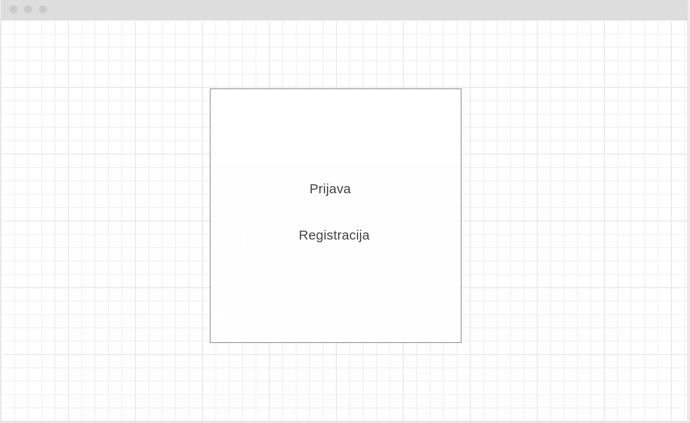

#### Prijava

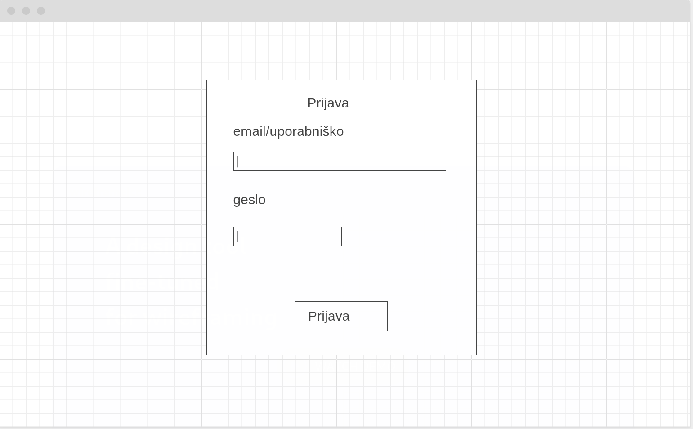

#### Registracija

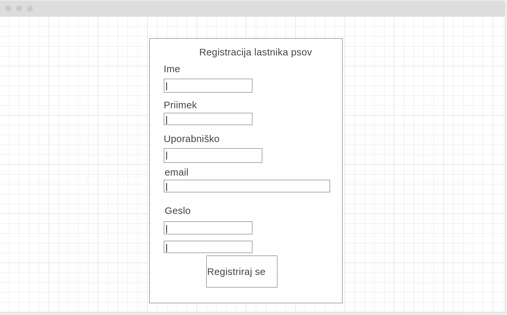
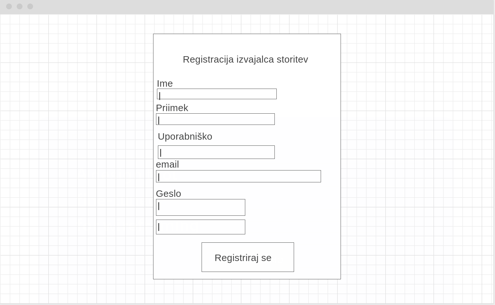

#### Pregled storitev

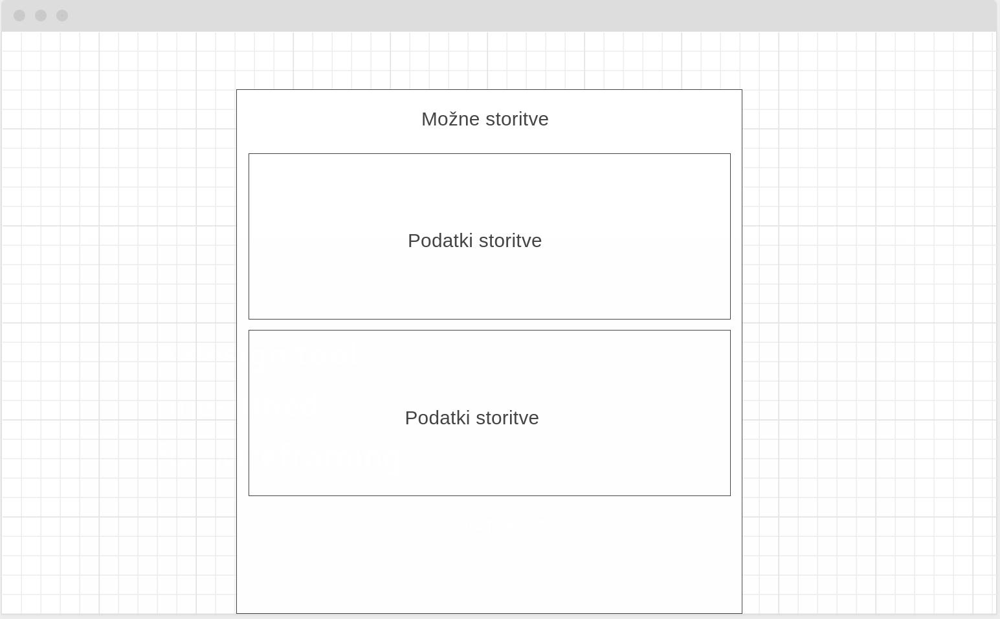

#### Pregled uporabnikov

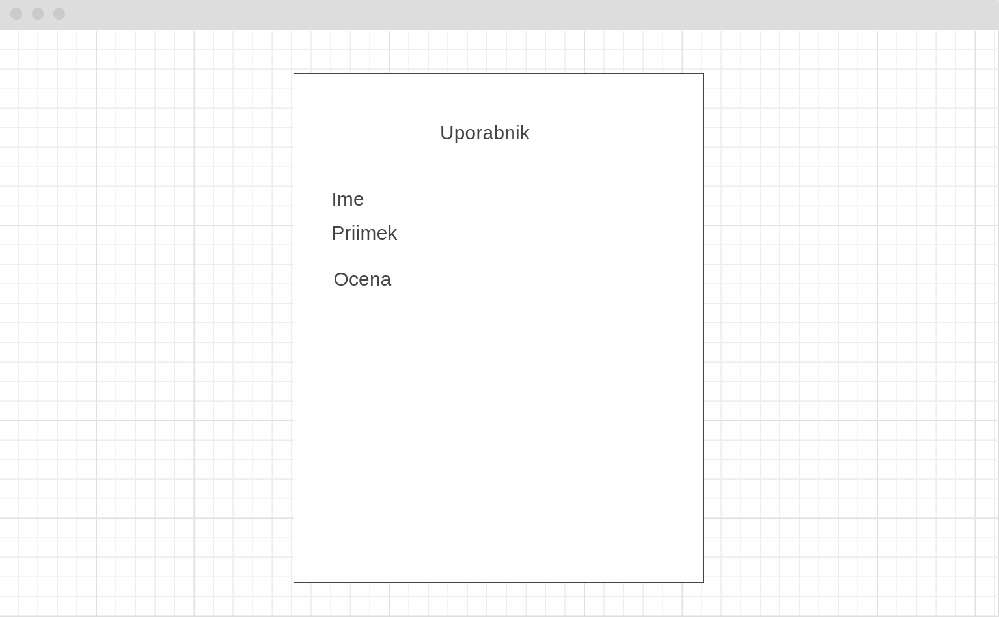

#### Ocenjevanje

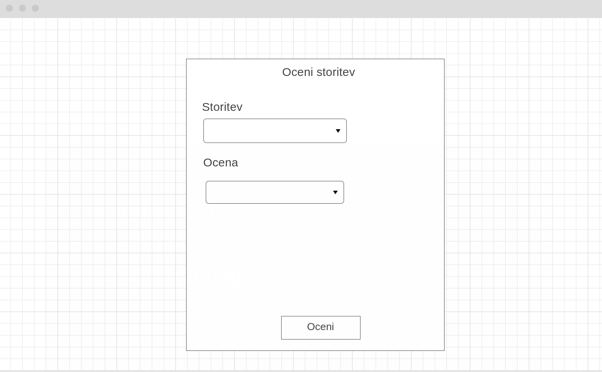

#### Dodaj Storitev

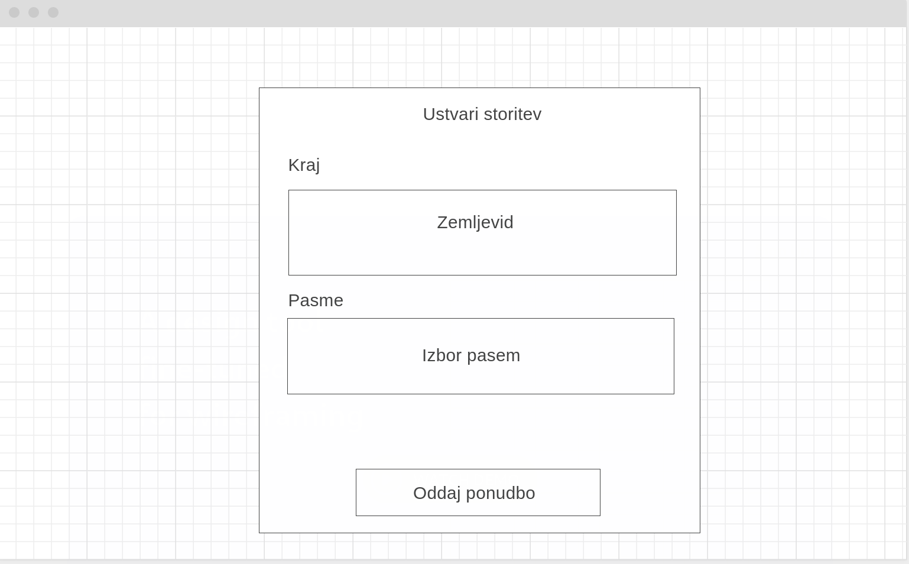

#### Uredi uporabnika kot Administrator

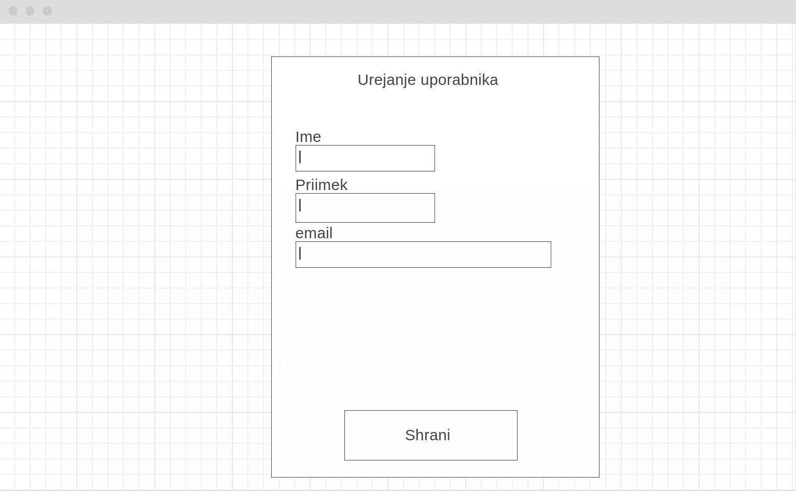

#### Uredi lastne podatke uporabnika

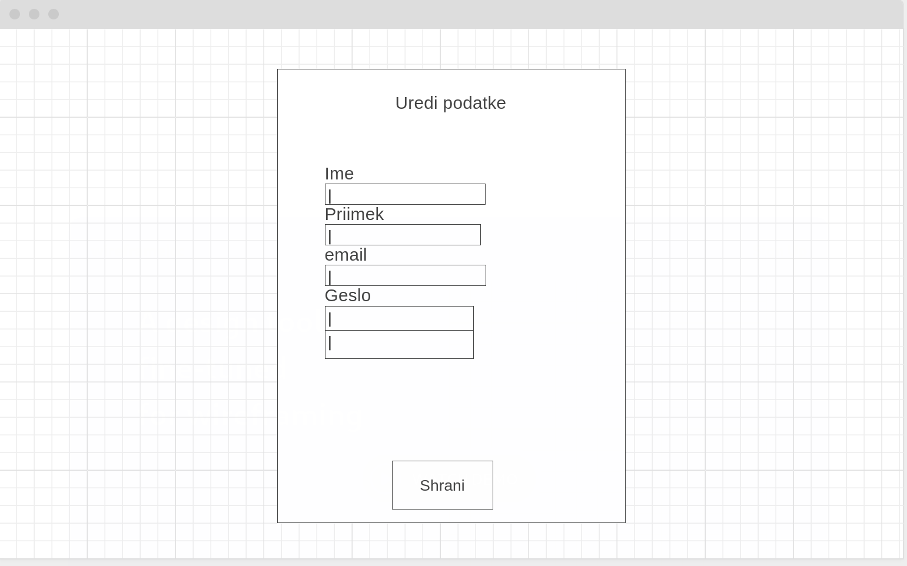

#### Dodaj psa

#### Kopiraj preteklo Storitev

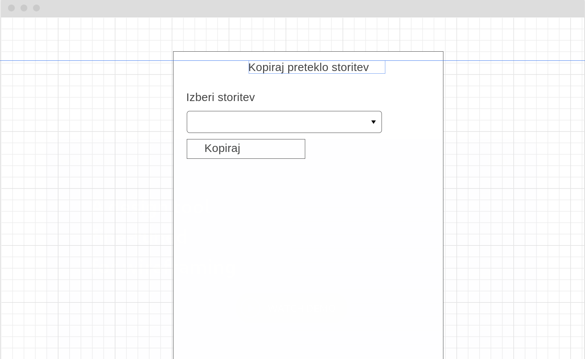

#### Pregled izvedenih storitev

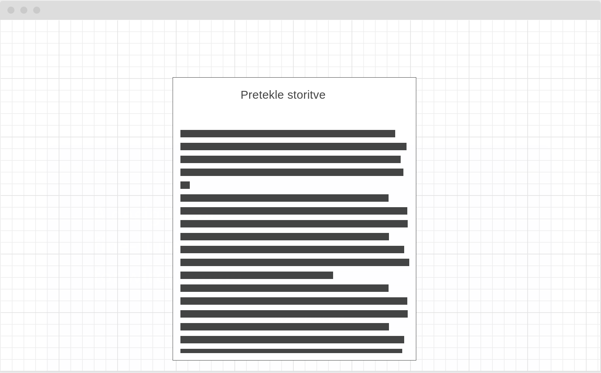

#### Komunikacija med izvajalcem in lastnikom

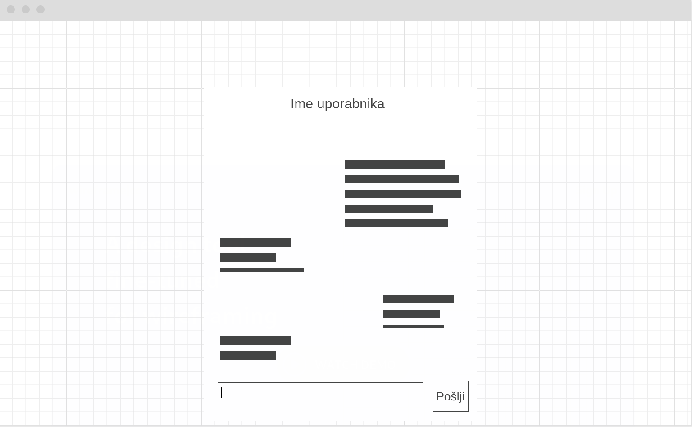

#### Pregled trenutne lokacije psa med izvajanjem

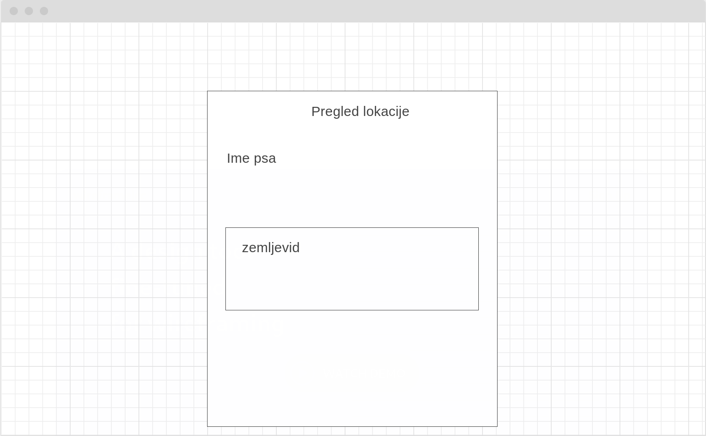

####

#### 7.1 Vmesniki do zunanjih sistemov

#### 7.1.1 Dodajanje ponudbe stortive <-> Leaflet zemljevid

var draggable = new L.Draggable(elementToDrag);
draggable.enable();

Leaflet API nam omogoča dodajanje premikajoče se oznake. S pomočjo zgornje metode omogočimo izvajalcu stortive da lahko premakne oznako na lokacijo, kjer želi ponujati storitev.

Ko izvajalec storitve potrdi lokacijo, pridobimo lokacijo oznake s pomočjo metode, getLatLng(elementToDrag), ter jo shranimo v interno bazo, za nadaljno uporabo.

#### 7.1.2 Pregled ponujenih storitev <-> Leaflet zemljevid

L.marker([X,Y]).addTo(map);

Leaflet API nam omogoča dodajanje oznake na zemljevid. Leaflet je že incicializiran. Ko uporabnik želi pogledati
ponujene storitve s pomočjo zgornje metode dodamo oznake na zemljevid. Oznake za vse stortive pridobimo iz notranje baze.

#### 7.1.3 Pregled lokacije psa med izvajanjem storitve<-> Leaflet zemljevid

L.marker([X,Y]).addTo(map);

Leaflet API nam omogoča dodajanje oznake na zemljevid. Leaflet je že incicializiran. Ko uporabnik želi pogledati
lokacijo psa med izvajanjem storitve, se s pomočjo zgornje metode dodamo oznako na zemljevid. Lokacijo izvajalca storitve
pridobimo iz interne baze.

#### 7.1.4 Dodajanje psa <-> The Dog Api

https\://<i></i>api.thedogapi.com/v1/breeds/search?q="NAME OF BREED"

The dog API sprejme ime pasme psa preko parametra q v url zahtevku, ter vrne podatke o pasmi v obliki datoteke JSON.
Datoteka JSON vsebuje tabelo objektov, Vsak objekt pa lahko vsebuje naslednje parametre:
- id (enolični identifikator)
- name (ime)
- temperament (značaj)
- life_span (življenska doba)
- alt_names (soimena)
- wikipedia_url 
- origin (poreklo)
- weight (teža)
- country_code (koda države)
- height (višina)

Lastnik psa izbere pasmo psa.V primeru da ime pasme ni natačno podano, dobimo v datoteki JSON več rezultatov iskanja v obliki objektov.

#### 7.1.5 Pregled ponujenih storitev <-> The Dog Api

https\://<i></i>api.thedogapi.com/v1/breeds/search?q="NAME OF BREED"

The dog API sprejme ime pasme psa preko parametra q v url zahtevku, ter vrne podatke o pasmi v obliki datoteke JSON.
Datoteka JSON vsebuje tabelo objektov, Vsak objekt pa lahko vsebuje naslednje parametre:
- id (enolični identifikator)
- name (ime)
- temperament (značaj)
- life_span (življenska doba)
- alt_names (soimena)
- wikipedia_url 
- origin (poreklo)
- weight (teža)
- country_code (koda države)
- height (višina)

Ker je storitev že bila ustvarjena, je tudi že bila izbrana pasma psa. Tako nam bo vrnil API samo en objekt s parametri dotične pasme.

#### 7.1.6 Dodajanje ponudbe stortive <-> The Dog Api

https\://<i></i>api.thedogapi.com/v1/breeds/search?q="NAME OF BREED"

The dog API sprejme ime pasme psa preko parametra q v url zahtevku, ter vrne podatke o pasmi v obliki datoteke JSON.
Datoteka JSON vsebuje tabelo objektov, Vsak objekt pa lahko vsebuje naslednje parametre:
- id (enolični identifikator)
- name (ime)
- temperament (značaj)
- life_span (življenska doba)
- alt_names (soimena)
- wikipedia_url 
- origin (poreklo)
- weight (teža)
- country_code (koda države)
- height (višina)

Izvajalec storitve lahko izbere da je storitev namenjena samo določeni pasmi psa. V primeru da ime pasme ni natačno podano, dobimo v datoteki JSON več rezultatov iskanja v obliki objektov.
